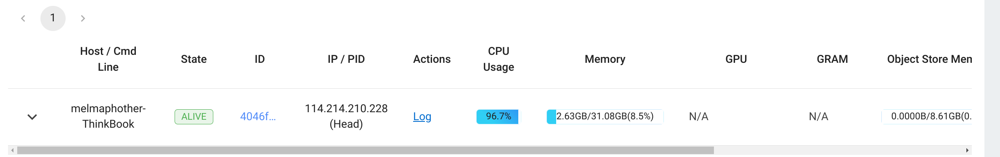

# 基于Ray的分布式计算任务部署与优化测试（CodeForWWWard）


## 部署Ray

操作系统:Linux Ubuntu

### Step1: 安装anaconda/miniconda

为保证使用环境一致、方便包管理及安装依赖项,我们先安装环境管理软件anaconda/miniconda,并创建运行ray的新环境。


```bash
# 下载安装脚本
$ wget https://repo.anaconda.com/miniconda/Miniconda3-latest-Linux-x86_64.sh
# 添加执行权限
$ chmod u+x Miniconda3-latest-Linux-x86_64.sh
# 运行安装脚本
$ ./Miniconda3-latest-Linux-x86_64.sh
```

根据提示选择安装目录后自动安装。

安装结束后，重启终端,提示符之前出现`(base)`则安装成功

### Step2: 创建新环境

```bash
# 创建一个名为env4ray，版本为x.x.x(你需要的python版本)的python环境
$ conda create --name env4ray python=x.x.x
```


成功创建后,显示如下:

```bash
# To activate this environment, use                                             
#                                                                               
#     $ conda activate env4ray
#
# To deactivate an active environment, use
#
#     $ conda deactivate

```

根据提示输入

```bash
$ conda activate env4ray
```

提示符前`(base)`变成`(env4ray)`则证明进入env4ray环境

> 遇到报错：`Proxy Error`
> 解决方法：关闭代理，`$ unset all_proxy && unset ALL_PROXY`并再次运行创建环境指令


### Step3: 安装ray

```bash
# pip安装
$    pip install -U 'ray[default]'

# 或conda安装
$    conda install -c conda-forge "ray-default"
```

安装后重启终端，进入`env4ray`，输入

```bash
$    ray --version
```

输出版本号则安装成功

### Step4: 启动ray
启动主节点：

```  bash
$     ray start --head --dashboard-host='0.0.0.0' --dashboard-port=8265
```

在输出中找到
```bash
To monitor and debug Ray, view the dashboard at 
    xxx.xxx.xxx.xxx:xxxx
```

在浏览器中输入该地址即可查看dashboard

### Docker部署
#### 安装Docker
```bash
$   curl -fsSL https://test.docker.com -o test-docker.sh
$   sudo sh test-docker.sh
```
#### 安装ray环境

```bash
$   docker pull rayproject/ray
```

#### 运行docker
```bash
$   docker run --shm-size=4G -tip 8265:8265 -p 3000:3000 -p 9000:9000 -p 6379:6379 rayproject/ray
```
运行后用户提示符变为`ray@xxxx`,开启ray主节点如下图：


## 代码部分

* 我们的测试任务选择的是计算矩阵的行列式

```python
def matrix_multiply1():
    A = np.random.randint(0,1000,1000000)
    A = A.reshape(1000, 1000)
    a = np.linalg.det(A)
    return 0
```

> 这段代码是随机生成矩阵元素为0-1000的数，矩阵大小为1000*1000。
>
> 特点是计算量大，可以明显体现出优化后的结果

* 带ray的代码版本

```python
import numpy as np
import time
import ray

ray.init()

def matrix_multiply1():
    A = np.random.randint(0,1000,1000000)
    A = A.reshape(1000, 1000)
    a = np.linalg.det(A)
    return 0


@ray.remote(num_cpus=16)
def matrix_multiply2():
    A = np.random.randint(0,1000,1000000)
    A = A.reshape(1000, 1000)
    a = np.linalg.det(A)
    return 0

#使用远程函数计算矩阵乘积
start_time = time.time()
results = [matrix_multiply1() for _ in range(100)]

end_time = time.time()
print("Time taken: {:.2f} seconds".format(end_time - start_time),"\n")


###################
start_time = time.time()
results = ray.get([matrix_multiply2.remote() for _ in range(100)])

end_time = time.time()
print("Time taken: {:.2f} seconds".format(end_time - start_time),"\n")

```

> 运行该程序，可以先后得到不带ray和带ray的运行时间，计算次数选择100次。

## 性能提升测试

#### 环境

我们进行性能测试的环境如下

| 指标       | 单机          |             | 多节点              |             |
| -------- | ----------- | ----------- | ---------------- | ----------- |
|          | `node_0`    | `node_0`    | `node_1`         | `node_2`    |
| `CPU`    | `i7-13700H` | `i7-13700H` | `Ryzen 7 6800HS` | `i7-10510U` |
| `CPU`核心数 | `20`        | `20`        | `16`             | `8`         |

测试时，考虑到最低的CPU核心数，我们采用的参数为`num_cpus=8`

#### 性能测试指标

- 资源使用率(Resource Utilization)：资源利用率衡量了系统在使用计算资源方面的效率。在Ray中，可以通过监测CPU利用率、内存使用情况和网络带宽等指标来评估资源利用率。
- 吞吐量(Throughput)：吞吐量是指在单位时间内完成的任务数量或计算量。在Ray中，可以通过衡量每秒完成的任务数量或计算任务的总量来评估吞吐量。较高的吞吐量表示系统能够高效地执行并行任务。
- 相应时间(Response Time)：响应时间是指从提交任务到任务完成所需的时间。较低的响应时间表示系统能够快速响应任务，并且具有较低的延迟。
- 扩展性(Scalability)：扩展性是指系统在增加计算资源时的性能表现。在Ray中，通过增加节点或工作进程的数量来扩展计算资源。一个具有良好扩展性的系统能够在增加计算资源的同时保持高性能。
- 并行性能(Parallel Performance)：并行性能是指在并行计算环境中的性能表现。在Ray中，可以通过测量并行任务的加速比和效率来评估并行性能。加速比是指在使用并行计算资源时，相对于单个计算资源的性能提升倍数；效率是指并行计算资源的利用效率。

#### 单机

- CPU占用率
  
  

- 运行时间
  
  

#### 多节点

- CPU占用率
  
  
  
  同时我们从`node1`的本机处使用`System Monitor`观察了`node1`的占用率
  
  

- 运行时间
  
  

#### 结论

可以看到，在多节点的情况下，无论是`CPU`使用率还是同一个任务的运行时间都有不同程度的减小。特别是同一个任务的运行时间，多节点的情况下，该指标从`31.50s`减小到`2.90s`。
