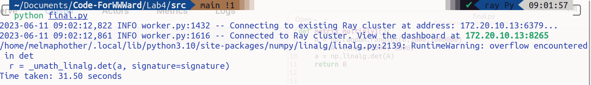

## 性能提升测试

#### 环境

我们进行性能测试的环境如下

| 指标       | 单机          |             | 多节点              |             |
| -------- | ----------- | ----------- | ---------------- | ----------- |
|          | `node_0`    | `node_0`    | `node_1`         | `node_2`    |
| `CPU`    | `i7-13700H` | `i7-13700H` | `Ryzen 7 6800HS` | `i7-10510U` |
| `CPU`核心数 | `20`        | `20`        | `16`             | `8`         |

测试时，考虑到最低的CPU核心数，我们采用的参数为`num_cpus=8`

#### 性能测试指标

- 资源使用率(Resource Utilization)：资源利用率衡量了系统在使用计算资源方面的效率。在Ray中，可以通过监测CPU利用率、内存使用情况和网络带宽等指标来评估资源利用率。
- 吞吐量(Throughput)：吞吐量是指在单位时间内完成的任务数量或计算量。在Ray中，可以通过衡量每秒完成的任务数量或计算任务的总量来评估吞吐量。较高的吞吐量表示系统能够高效地执行并行任务。
- 相应时间(Response Time)：响应时间是指从提交任务到任务完成所需的时间。较低的响应时间表示系统能够快速响应任务，并且具有较低的延迟。
- 扩展性(Scalability)：扩展性是指系统在增加计算资源时的性能表现。在Ray中，通过增加节点或工作进程的数量来扩展计算资源。一个具有良好扩展性的系统能够在增加计算资源的同时保持高性能。
- 并行性能(Parallel Performance)：并行性能是指在并行计算环境中的性能表现。在Ray中，可以通过测量并行任务的加速比和效率来评估并行性能。加速比是指在使用并行计算资源时，相对于单个计算资源的性能提升倍数；效率是指并行计算资源的利用效率。

#### 单机

- CPU占用率
  
  

- 运行时间
  
  

#### 多节点

- CPU占用率
  
  
  
  同时我们从`node1`的本机处使用`System Monitor`观察了`node1`的占用率
  
  

- 运行时间
  
  

#### 结论

可以看到，在多节点的情况下，无论是`CPU`使用率还是同一个任务的运行时间都有不同程度的减小。特别是同一个任务的运行时间，多节点的情况下，该指标从`31.50s`减小到`2.90s`。
