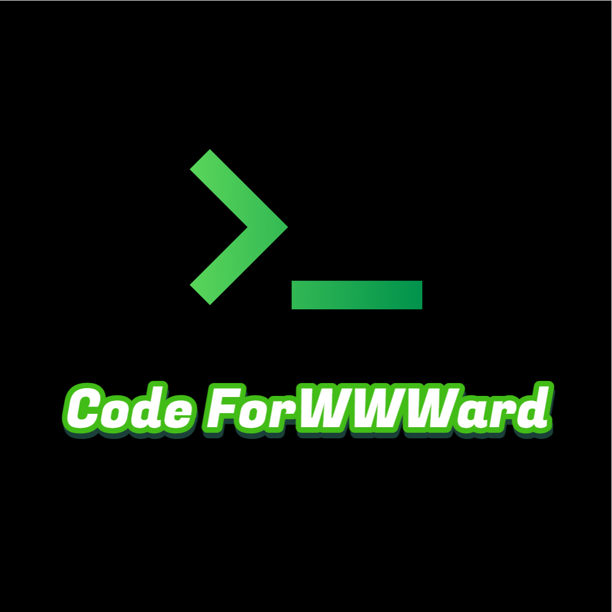

# Code ForWWWard

This is our teamwork in OSH 2023

## our logo

## Introduction to our team

C stands for **陈应豪**, F stands for **封霁芩**, WWW stands for **王润泽、王道宇、王昱**

Code ForWWWard means our team will keep moving on and never stop coding

## Teammates

#### Leader

- [王润泽](https://github.com//spark0685)

#### Crews

- [封霁芩](https://github.com//SMGJ222)

- [王道宇](https://github.com//Melmaphother)

- [王昱](https://github.com//Wloner0809)  

- [陈应豪](https://github.com//StivenKingsberg)

## Timelines

#### 3.16会议 题目调研分工

- 实时操作系统：王道宇，王润泽
- 移动操作系统：封霁芩
- 机器人操作系统：王昱
- 内存管理/虚拟化：陈应豪

#### 3.18线上讨论

综合小组成员调研结果，初定选题方向为机器人操作系统ROS

#### 3.27会议

- 讨论出三个可行的题目
  
  - 无人机集群调度
  - 混合内核
  - 智慧交通系统-plus

- 下一步计划：根据三个题目分工进行项目背景、所需硬件、相关的操作系统、已有的相关项目调研

#### [3.31会议](log/2023%E5%B9%B403%E6%9C%8831%E6%97%A5%E9%9B%86%E4%BD%93%E8%B0%83%E7%A0%94%E8%AE%B0%E5%BD%95.md)   调研报告讨论及分工

#### [4.4会议](log/2023年04月04日集体调研记录.md)    调研进步的汇报与调研报告的初稿

#### [4.7会议](log/2023%E5%B9%B404%E6%9C%8807%E6%97%A5%E4%BC%9A%E8%AE%AE%E8%AE%B0%E5%BD%95.md) 调研报告修改分工

#### [4.11会议](log/4%E6%9C%8811%E6%97%A5%E4%BC%9A%E8%AE%AE%E8%AE%B0%E5%BD%95.md)

#### [4.14会议](log/4%E6%9C%8814%E6%97%A5%E4%BC%9A%E8%AE%AE%E8%AE%B0%E5%BD%95.md)

#### [4.18会议](log/4%E6%9C%8818%E6%97%A5%E4%BC%9A%E8%AE%AE%E8%AE%B0%E5%BD%95.md)
