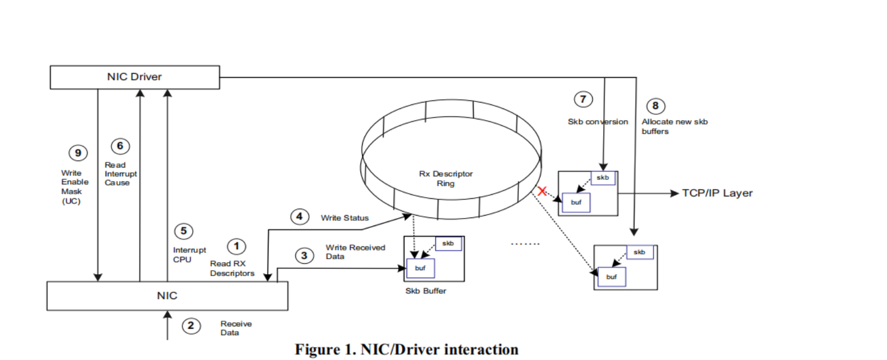
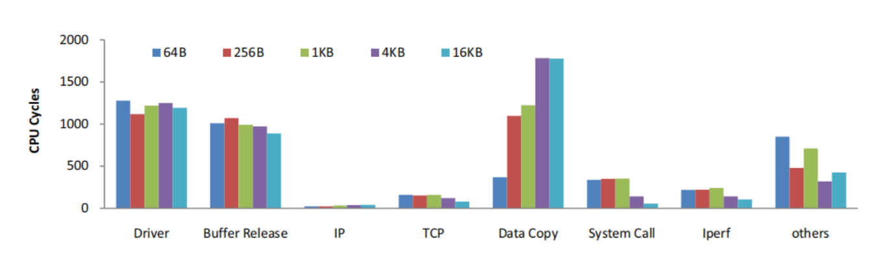
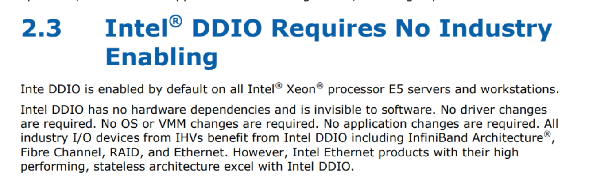

# 文献调研

#### **A New Server I/O Architecture for High Speed Networks**

- 一句话概括

  提出一个新的满足高速网络需求的新服务器IO架构。

  （ps：这文章和DCA关系不大，它企图说明DCA不够好）

- 干了什么事

> we propose a new server I/O architecture where DMA descriptor management is shifted from NICs to an on-chip network engine (NEngine), and descriptors are extended with information about data incurring memory stalls. 

受这些研究的启发，我们提出了一种新的服务器 I/O 架构，其中 DMA 描述符管理从 NIC 转移到片上网络引擎 (NEngine)，并且描述符扩展了有关导致内存停顿的数据的信息。

- 研究思路

  网络速度提升，高网速需要低复杂度网卡，需要高效网络处理。

- 传统体系结构问题
  -   侧重于CPU/内存密集型应用程序，通常与 I/O 考虑因素脱钩。它们对于网络处理来说效率低下。
  -   PCI总线获取DMA描述符延迟长。
  - 需要更大网卡缓冲区保存临时数据包。
- 其他人的解决方案
  - L. Zhao, L. Bhuyan, R. Iyer et al., "Hardware Support for Accelerating Data Movement in Server platform", IEEE Transactions On Computer, Vol 56, No. 6, 2007. 使用缓存模拟器研究TCP/IP协议的缓存行为
  - intel提出DCA将传入的网络数据路由到缓存。
  - Binkert等人 [2‑3] 将简化的 NIC 集成到 CPU 中以自然地实现 DCA 并使用程序 I/O (PIO) 在软件中从 NIC 移动数据。
  - 英特尔提出了片上消息引擎来在 I/O 设备和 CPU 之间移动数据，以减少 PCI‑E 流量 [17]
  - 这些工作没有研究OS级别的开销。（网卡，缓冲区管理）
- 本文做了啥
  - 在基于**英特尔至强四核处理器**的服务器上**运行超过 10GbE 的网络基准（benchmark） Iperf [10]**。
  - 发现**驱动程序**和**缓冲区释放**占了几乎一半IO时间
  - 网络处理的主要瓶颈在于**驱动**（>26%）、**数据复制**（根据 I/O 大小高达 34%）和**缓冲区释放**（>20%） ，而不是 TCP/IP 协议本身
  - 与高延迟网卡寄存器访问不同，本文认为驱动开销来自内存停顿到网络缓冲区。
  - 在OS中释放网络缓冲区会导致内核页面数据结构的内存停滞，从而导致缓冲区释放开销

补充：内存停滞是什么？

Memory stall指的是在CPU执行指令时发生的一种情况，即CPU需要等待数据从主存（RAM）加载到缓存中，以便执行下一条指令。当CPU在执行指令时需要访问未被缓存的内存地址时，就会发生memory stall。这是因为主存的速度相对较慢，与CPU内部的处理速度不匹配，因此导致了CPU需要暂停等待缓存更新，直到需要的数据被加载为止。Memory stall可以降低CPU的性能和效率，因此减少其出现可以提高系统的运行速度。

- 传统存储

  

- 挑战

  - 需要通过总线读描述符，总线太慢了
  - 需要太多NIC缓冲区
  - 传输队列太多了，导致NIC设计复杂。

- 处理开销分析

  

  - 驱动和缓冲释放是大开销。
  - 数据拷贝随着数据量增大增大。

- 驱动程序瓶颈

  - 有人提出NIC集成节约驱动程序NIC寄存器读写开销。
  - 作者认为主要来自SKB转换和缓冲区分配。
  -  SKB 是内存停顿的主要来源。
  - 最近的 Intel 平台中实施的 DCA 避免了 L2 缓存未命中，但它无法减少 L1 缓存未命中和一系列加载/存储指令执行的开销（总计约 47%）。
  - 由于 L1 缓存较小 [19、35]，将网络数据路由到 L1 缓存会污染缓存并降低性能。
  - IO需求很高时，扩展DCA可以解决内存停顿，但是会压力网卡和总线。

- 解决方案

  - 不用网卡读写描述符，造一个靠近 LLC 的附加片上网络引擎 (NEngine）来读写描述符和数据包移动。
  - 不用RX/TX队列，用LLC暂存数据包
  - 扩展描述符
  - 简化NIC

- 评估方法

  - 用的系统模拟器 Simics

- 结论

  - 比DCA-L2好14%。
  - 提高了缓存命中率。
  - IO量大。
  - DMA驱动压力变小。
  - 不用很多NIC buffer。

-  可以看看的文献

  - 解决了DCA带来小型LLC缓存污染问题

    D. Tang, Y. Bao, W. Hu et al., "DMA Cache: Using On-chip Storage to Architecturally Separate I/O Data from CPU Data for Improving I/O Performance", HPCA, 2010

    

**Understanding I/O Direct Cache Access Performance for EndHost Networking**

- 一句话概括

  另外一篇文章的abstract，太抽象了，没啥具体内容。

- 主要工作

  - 开发了⼀个分析框架来预测 DCA 在特定硬件规格、系统配置和应用程序属性下的有效性（即命中率）
  - 系统地衡量优化 DCA 的好处，应用程序可以使用惩罚测量来确定其 DCA 命中率的调整数目。

- [DDIO文档](https://web.archive.org/web/20210225132434/https://www.intel.com/content/dam/www/public/us/en/documents/technology-briefs/data-direct-i-o-technology-brief.pdf)

  

[官网DDIO介绍](https://www.intel.com/content/www/us/en/io/data-direct-i-o-technology.html#:~:text=Intel%20DDIO%20makes%20the%20processor,latency%2C%20and%20reduced%20power%20consumption)

Intel created Intel DDIO to allow Intel® Ethernet Controllers and adapters to talk directly with the processor cache of the **Intel Xeon processor E5 family and Intel Xeon processor E7 v2 family.**