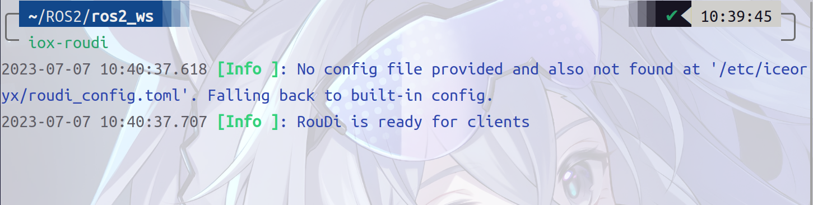
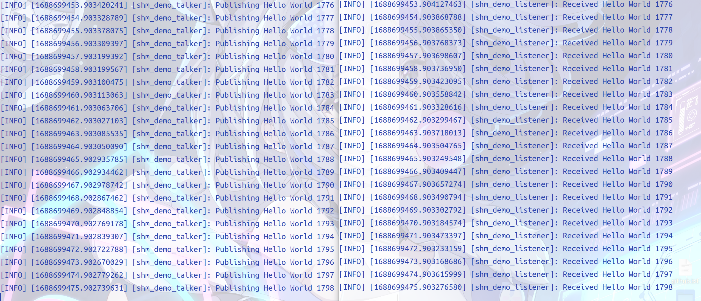
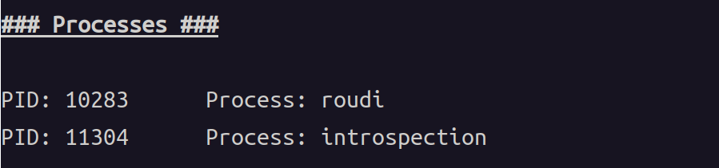

## ROS2中使用零拷贝传输

在DCA技术寿终正寝之后，我们小组没有放弃ROS2零拷贝通信传输的思路，之后我们查阅资料，找到了名为`iceoryx`的中间件来解决零拷贝通信传输的问题。

> 什么是中间件？
> 
> 中间件是指不同程序用于相互通信的软件。它提供智能，高效连接应用程序的功能。中间件相当于不同技术，工具和数据库之间的桥梁，是应用，数据与用户的纽带。

- `iceory`是一个适用于各种操作系统的进程间通信（`IPC`）的中间件，起源于汽车行业，要求在不同进程之间传输大量数据。高效的通信机制也可以用于更广泛的情形，例如机器人或游戏开发领域。
  
  `iceoryx`使用真正的零拷贝，**共享内存**的方法，允许将数据从发布者传输到订阅者，而无需单个副本。这确保了数据传输具有恒定的延迟。
  
  `iceoryx`的一个重要方面是，发布者可以在订阅者仍在阅读时再次写入，因为没有订阅者的干扰。如果前一个内存块仍在使用中，则只需为发布者分配一个新的内存块。
  
  如果订阅者在轮询模式下运行，并且块排队等待订阅者再次检查队列，我们​​可以在我们称为“安全溢出”的过程中使用无锁队列回收旧的内存块。无锁队列使我们能够保证与订阅者就存储在队列中的最新消息的最大数量达成内存高效的合同，无论连续订阅者轮询之间的时间有多长。

- 我们小组做的
  
  在ros2下如何使用零拷贝共享内存数据传输？
  
  - 使用中间件`Eclipse CycloneDDS`，它集成了`Eclipse iceoryx`来进行共享内存传输。由于它使用char数组作为其有效负载数据，因此该`demo`可以轻松地推广到图像和点云等任意数据类型。
  
  - 首先，在不同的窗口均激活用于共享内存的配置：
    
    ```bash
    export CYCLONEDDS_URI=file://$PWD/src/ros2_shm_demo/cyclonedds.xml
    ```
  
  - 在第一个窗口运行守护进程`iox-roudi`（`daemon(守护神)`）
    
    ```bash
    ros2 run ros2_shm_demo iox-roudi
    ```
    
    
  
  - 在第二个窗口运行`talker`：
    
    ```bash
    ros2 run ros2_shm_demo talker
    ```
  
  - 在第三个窗口运行`listener`：
    
    ```bash
    ros2 run ros2_shm_demo listener
    ```
    
    
  
  - 在第四个窗口运行进程通信监视器：
    
    编译：
    
    ```bash
    cd iceoryx/tools/introspection
    cmake -Bbuild
    cd build
    make
    ```
    
    运行：
    
    ```bash
    ./iox-introspection-client --all
    ```
    
    验证是否在使用共享内存：
    
    - 监视器中`Processes`部分`talker`和`listener`的`introspection`进程ID应该相同：
      
      
    
    - `MemPool`中`Chunk Payload Size`，即块使用数量将会上升：
      
      
    
    - 同时Min Free（剩余共享内存量）将会单调递减
      
      由上图可以看出。
