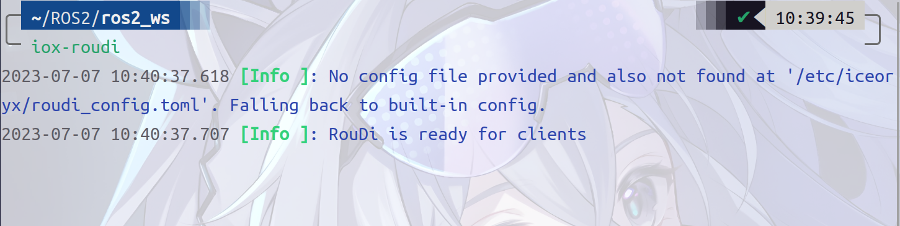

# 结题报告 Code-ForWWWard

**小组成员**

* 王润泽 PB21020685
* 王道宇 PB21030794
* 封霁芩 PB21111670
* 陈应豪 PB21000117
* 王    昱 PB21030814

## 1 项目简介

本项目旨在基于现有的零拷贝技术，对现有的ROS2机器人操作系统进行实时性优化，实现数据传输的超低延迟，对多个物理中断的实时沟通问题进行解决，并希望以此作为对万物互联时代多机协同工作实时沟通与协同问题的一次积极实践。

## 2 项目背景

### 2.1 ROS2

#### 2.1.1 ROS 简介

ROS(Robot Operating Systems)是一个机器人领域的元操作系统，是一个分布式的通信框架，能够帮助进程间更方便地实现通信，协调一个机器人的各个部件或多个机器人组成的机器人集群完成任务。


#### 2.1.2 ROS2 的通信机制

为了达到简化机器人开发的设计目的，ROS 开发了一整套通讯机制，包括话题，服务参数和动作。为了将各个机器人节点连接起来并实现通信，ROS 引入了 `ROS Master`节点，所有节点的通讯必须经过这个主节点。


#### 2.1.3 ROS vs ROS2

ROS1具备以下不足：

- 仅支持Linux系统
- 基于TCP/IP的通信方式，点对点的分布式通信机制，实时性差，系统开销大
- 依赖于ROS master管理所有节点的通讯，稳定性差
- 对Python3支持不友好

ROS2对此做出了改进：

- 支持Linux、Windows、Mac OS、嵌入式RTOS等，跨平台特性得到改善
- 引入DDS通信协议，可通过零拷贝的方式传递消息，节约CPU、内存的资源，实时性得到了很大的提升
- 去中心化：去除了ROS master中心节点管理器，节点地位平等，可以一对一、一对多、多对多互相通信，稳定性、可靠性得到了很大的提高
- 支持Python3

改进前后ROS的架构如下：


#### 2.1.4 ROS2 实时性的缺陷

**`Linux`内核的实时性不足**：

- `Linux`内核的调度机制并不是针对实时性的，这使得`Linux`无法提供完全实时的响应。 `ROS2`使用通用的通信框架，它的设计并不是专门为实时性而优化的。`ROS2`使用`DDS`作为通信协议，`DDS`是一种高度灵活的通信协议，但其对实时性能的支持并不足够强大。

**`ROS2`的性能瓶颈**

- **CPU资源占用**：需要占用`CPU`资源进行消息的序列化、反序列化、传输等操作，如果`CPU`资源占用过高，则会影响实时性能
- **内存管理**：涉及到内存的动态分配和释放，如果内存管理不当，会导致内存碎片问题，从而影响实时性能

### 2.2 零拷贝技术

#### 2.2.1 NIC与CPU交互模式

网卡(Network Interface Card，简称`NIC`)，也称网络适配器，是电脑与局域网相互连接的设备。

**Ring-based Model**

初始化时，处理器在内存中为传入和传出的数据包分配缓冲区。它在描述符中记录缓冲区的属性(例如，它们的基址和长度)，并将这些描述符存储在两个环中，一个用于发送(`TX`)，另一个用于接收(`RX`)


- **数据包到达时**
  - S2:NIC读取环头指向的描述符以获取空缓冲区，将数据包内容写入缓冲区，并更新描述符以记录数据包的属性。
  - S3:向处理器发送中断，以通知数据包的到达。
  - S4:处理器通过中断或对尾指针所指向的描述符进行忙轮询来得到通知。它给出一个新的描述符，指向`RX`环的空缓冲区，移动尾指针，并将接收到的缓冲区移交给应用程序。
- **发送数据包时**
  - S5: 一旦处理程序完成，驱动程序在`head`指针指向的空`TX`描述符上申请缓冲区，并移动指针提示`NIC`;
  - S6: `NIC`读取`TX`描述符，获取缓冲区，并将其内容发送到线路，移动`TX`尾以指示数据包发送完成;
  - S7: 驱动定期检查TX环以回收已发送的缓冲区

NIC与处理器有多种交换数据信息的模式，包括中断、内存映射IO (MMIO)和直接内存访问(DMA)。

#### 2.2.2 DMA技术 vs DCA技术

`DMA` (Direct Memory Access)技术，其基本思想是外设和 `RAM` 之间开辟直接的数据传输通路。一般情况下，总线所有的工作周期（总线周期）都用于`CPU` 执行程序。`DMA` 控制就是当外设完成数据 `I/O` 的准备工作之后，会占用总线的一个工作周期，和 `RAM` 直接交换数据。这个周期之后，`CPU`又继续控制总线执行原程序。如此反复的，直到整个数据块的数据全部传输完毕，从而解放了`CPU`。

`DCA` (Direct Cache Access)技术通过将目标从内存更改为处理器缓存来改进`DMA`。这有助于减少`I/O`延迟，并通过防止数据在内存总线上传输两次来节省内存带宽。`DCA`是一个通用术语，其实现方式各异。


#### 2.2.3 

## 3 项目设计

### 3.1 项目整体架构

### 3.2 技术路线

### 3.3 设计难点

#### 3.3.1 DCA放弃使用

* `DCA`关不掉，设备支持`DCA`模块即默认打开，如果关掉则会导致与它相关的依赖无法工作。
  
  
  * 我们曾尝试关掉`DCA`模块，结果导致服务器上连包也下载不了，最终只能去实验室重装服务器系统，重新配置服务器

* `grub`文件改内核选项，保存不了也运行不了

* `dca.h`头文件用户态无法调用，只能使用内核态调用。而内核态代码调试困难

#### 3.3.2 服务器配置困难

* **帮助我们配置的学长**说这个服务器是很早之前的，服务器本身存在一点问题
* 由于网络并不是我们项目的重点，而配置服务器的`ssh`需要一些网络知识，这导致我们所作的无用功增加，浪费了时间，拖延了项目的进展

### 3.3.3 ROS2环境搭建以及零拷贝的实现

* 由于`DCA`宣告失败，我们尝试使用`zero-copy`来优化通信。经过多番尝试，我们利用`iceoryx`这一个中间件，通过调用和改写实现了一个`zero-copy`的`demo`程序

## 4 实验过程

### 4.1 ROS2部署


### 4.2 中间件部署

在DCA技术寿终正寝之后，我们小组没有放弃ROS2零拷贝通信传输的思路，之后我们查阅资料，找到了名为`iceoryx`的中间件来解决零拷贝通信传输的问题。

> 什么是中间件？
> 
> 中间件是指不同程序用于相互通信的软件。它提供智能，高效连接应用程序的功能。中间件相当于不同技术，工具和数据库之间的桥梁，是应用，数据与用户的纽带。

- `iceory`是一个适用于各种操作系统的进程间通信（`IPC`）的中间件，起源于汽车行业，要求在不同进程之间传输大量数据。高效的通信机制也可以用于更广泛的情形，例如机器人或游戏开发领域。
  
  `iceoryx`使用真正的零拷贝，**共享内存**的方法，允许将数据从发布者传输到订阅者，而无需单个副本。这确保了数据传输具有恒定的延迟。
  
  `iceoryx`的一个重要方面是，发布者可以在订阅者仍在阅读时再次写入，因为没有订阅者的干扰。如果前一个内存块仍在使用中，则只需为发布者分配一个新的内存块。
  
  如果订阅者在轮询模式下运行，并且块排队等待订阅者再次检查队列，我们​​可以在我们称为“安全溢出”的过程中使用无锁队列回收旧的内存块。无锁队列使我们能够保证与订阅者就存储在队列中的最新消息的最大数量达成内存高效的合同，无论连续订阅者轮询之间的时间有多长。

- 我们小组做的
  
  在ros2下如何使用零拷贝共享内存数据传输？
  
  - 使用中间件`Eclipse CycloneDDS`，它集成了`Eclipse iceoryx`来进行共享内存传输。由于它使用char数组作为其有效负载数据，因此该`demo`可以轻松地推广到图像和点云等任意数据类型。
  
  - 首先，在不同的窗口均激活用于共享内存的配置：
    
    ```bash
    export CYCLONEDDS_URI=file://$PWD/src/ros2_shm_demo/cyclonedds.xml
    ```
  
  - 在第一个窗口运行守护进程`iox-roudi`（`daemon(守护神)`）
    
    ```bash
    ros2 run ros2_shm_demo iox-roudi
    ```
    
    
  
  - 在第二个窗口运行`talker`：
    
    ```bash
    ros2 run ros2_shm_demo talker
    ```
  
  - 在第三个窗口运行`listener`：
    
    ```bash
    ros2 run ros2_shm_demo listener
    ```
    
    
  
  - 在第四个窗口运行进程通信监视器：
    
    编译：
    
    ```bash
    cd iceoryx/tools/introspection
    cmake -Bbuild
    cd build
    make
    ```
    
    运行：
    
    ```bash
    ./iox-introspection-client --all
    ```
    
    验证是否在使用共享内存：
    
    - 监视器中`Processes`部分`talker`和`listener`的`introspection`进程ID应该相同：
      
      
    
    - `MemPool`中`Chunk Payload Size`，即块使用数量将会上升：
      
      
    
    - 同时Min Free（剩余共享内存量）将会单调递减
      
      由上图可以看出。

## 5 实验结果

## 6 总结

## 参考文献

##### 
