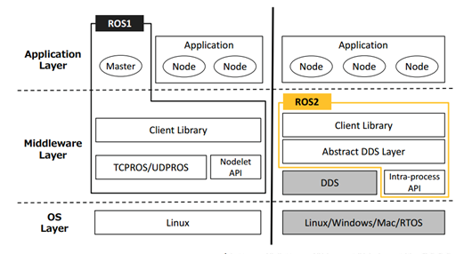

# 结题报告 Code-ForWWWard

**小组成员**

* 王润泽 PB21020685
* 王道宇 PB21030794
* 封霁芩 PB21111670
* 陈应豪 PB21000117
* 王    昱 PB21030814

## 1 项目简介

本项目旨在基于现有的零拷贝技术，对现有的ROS2机器人操作系统进行实时性优化，实现数据传输的超低延迟，对多个物理中断的实时沟通问题进行解决，并希望以此作为对万物互联时代多机协同工作实时沟通与协同问题的一次积极实践。

## 2 项目背景

### 2.1 ROS2

#### 2.1.1 ROS 简介

ROS(Robot Operating Systems)是一个机器人领域的元操作系统，是一个分布式的通信框架，能够帮助进程间更方便地实现通信，协调一个机器人的各个部件或多个机器人组成的机器人集群完成任务。


#### 2.1.2 ROS2 的通信机制

为了达到简化机器人开发的设计目的，ROS 开发了一整套通讯机制，包括话题，服务参数和动作。为了将各个机器人节点连接起来并实现通信，ROS 引入了 `ROS Master`节点，所有节点的通讯必须经过这个主节点。


#### 2.1.3 ROS vs ROS2

ROS1具备以下不足：

- 仅支持Linux系统
- 基于TCP/IP的通信方式，点对点的分布式通信机制，实时性差，系统开销大
- 依赖于ROS master管理所有节点的通讯，稳定性差
- 对Python3支持不友好

ROS2对此做出了改进：

- 支持Linux、Windows、Mac OS、嵌入式RTOS等，跨平台特性得到改善
- 引入DDS通信协议，可通过零拷贝的方式传递消息，节约CPU、内存的资源，实时性得到了很大的提升
- 去中心化：去除了ROS master中心节点管理器，节点地位平等，可以一对一、一对多、多对多互相通信，稳定性、可靠性得到了很大的提高
- 支持Python3

改进前后ROS的架构如下：



#### 2.1.4 ROS2 实时性的缺陷

**`Linux`内核的实时性不足**：

- `Linux`内核的调度机制并不是针对实时性的，这使得`Linux`无法提供完全实时的响应。 `ROS2`使用通用的通信框架，它的设计并不是专门为实时性而优化的。`ROS2`使用`DDS`作为通信协议，`DDS`是一种高度灵活的通信协议，但其对实时性能的支持并不足够强大。

**`ROS2`的性能瓶颈**

- **CPU资源占用**：需要占用`CPU`资源进行消息的序列化、反序列化、传输等操作，如果`CPU`资源占用过高，则会影响实时性能
- **内存管理**：涉及到内存的动态分配和释放，如果内存管理不当，会导致内存碎片问题，从而影响实时性能

### 2.2 零拷贝技术

#### 2.2.1 NIC与CPU交互模式

网卡(Network Interface Card，简称`NIC`)，也称网络适配器，是电脑与局域网相互连接的设备。

**Ring-based Model**

初始化时，处理器在内存中为传入和传出的数据包分配缓冲区。它在描述符中记录缓冲区的属性(例如，它们的基址和长度)，并将这些描述符存储在两个环中，一个用于发送(`TX`)，另一个用于接收(`RX`)


- **数据包到达时**
  - S2:NIC读取环头指向的描述符以获取空缓冲区，将数据包内容写入缓冲区，并更新描述符以记录数据包的属性。
  - S3:向处理器发送中断，以通知数据包的到达。
  - S4:处理器通过中断或对尾指针所指向的描述符进行忙轮询来得到通知。它给出一个新的描述符，指向`RX`环的空缓冲区，移动尾指针，并将接收到的缓冲区移交给应用程序。
- **发送数据包时**
  - S5: 一旦处理程序完成，驱动程序在`head`指针指向的空`TX`描述符上申请缓冲区，并移动指针提示`NIC`;
  - S6: `NIC`读取`TX`描述符，获取缓冲区，并将其内容发送到线路，移动`TX`尾以指示数据包发送完成;
  - S7: 驱动定期检查TX环以回收已发送的缓冲区

NIC与处理器有多种交换数据信息的模式，包括中断、内存映射IO (MMIO)和直接内存访问(DMA)。

**传统交互模式:**


**零拷贝交互模式:**


#### 2.2.2 DMA技术 vs DCA技术

`DMA` (Direct Memory Access)技术，其基本思想是外设和 `RAM` 之间开辟直接的数据传输通路。一般情况下，总线所有的工作周期（总线周期）都用于`CPU` 执行程序。`DMA` 控制就是当外设完成数据 `I/O` 的准备工作之后，会占用总线的一个工作周期，和 `RAM` 直接交换数据。这个周期之后，`CPU`又继续控制总线执行原程序。如此反复的，直到整个数据块的数据全部传输完毕，从而解放了`CPU`。

`DCA` (Direct Cache Access)技术通过将目标从内存更改为处理器缓存来改进`DMA`。这有助于减少`I/O`延迟，并通过防止数据在内存总线上传输两次来节省内存带宽。`DCA`是一个通用术语，其实现方式各异。


#### 2.2.3 通信中间件

什么是中间件？
 
中间件是指不同程序用于相互通信的软件，通信中间件是指在分布式系统中用于处理不同节点之间通信的软件组件或工具。它提供了一种可靠和高效的方式，使得在分布式环境中的不同节点之间可以进行数据交换和消息传递。


在ROS中，通信中间件起着关键的作用。ROS提供了一种基于发布-订阅模式的通信机制，使用通信中间件来实现节点之间的消息传递和服务调用。通过使用通信中间件，ROS系统可以实现多节点之间的高效通信和协同工作，支持复杂的机器人系统和分布式计算环境。

ROS2使用DDS通信协议，用于实现分布式系统中的数据传输和消息交换。它定义了一组规则和标准，用于在分布式环境中的不同节点之间进行可靠、实时的数据通信。而中间件是实现DDS规范的软件组件或工具。它是一种通信中间件，用于实现DDS协议，并提供了相应的功能和接口，使得节点能够进行数据的发布、订阅和交换。

下面是ROS2中一些常用的通信中间件：

1. Fast DDS: ROS 2的默认通信中间件，基于DDS标准开发。它提供高性能、可靠的消息传递和分布式计算支持。Fast DDS具有低延迟、高吞吐量和可扩展性的特点，适用于实时系统和大规模部署。它支持发布-订阅模式、请求-响应模式和事件模式，提供多种数据类型支持和灵活的QoS配置。Fast DDS还提供丰富的工具和库，用于开发和调试ROS 2应用程序。

2. Cyclone DDS:具有轻量级和可嵌入性的特点，适用于嵌入式系统和资源受限的环境。它提供了可扩展的架构，支持多种操作系统和硬件平台，并具有低延迟和高吞吐量的特性。Cyclone DDS还提供了丰富的功能和工具，以简化开发和部署分布

3. OpenSplice DDS：一个开源的通信中间件，具有强大的数据管理和分发机制。提供了灵活的配置选项和丰富的功能，包括发布-订阅模式、请求-响应模式和数据历史管理

总的来说通信中间件提供智能、高效连接应用程序的功能，是不同技术，工具和数据库之间的桥梁，是应用，数据与用户的纽带。


## 3 项目设计

### 3.1 项目整体架构


### 3.2 技术路线


我们首先想到的是要用`DMA技术`来优化`ROS2`通信以提高其实时性，接着由老师推荐以及我们自己的了解，我们转向使用`DCA技术`优化`ROS2`通信(因为`DCA`性能更高)，设想是开发一个`ROS2的包或者插件`。老师向我们推荐了实验室的服务器，于是我们花费了一定的时间去配置服务器。在学期后半段，我们耗费了巨大的精力去探究`DCA技术`，尝试多次发现它实际不可行。我们最后决定将主要精力投入到`ROS2`的研究，实现了从`ROS2单机`到`ROS2多机`最后到`ROS2单机不同进程实现零拷贝`。

### 3.3 设计难点与困难

#### 3.3.1 DCA放弃使用

* `DCA`无法关闭，设备支持`DCA`模块即默认打开，如果关闭则会导致与它相关的依赖无法工作。
  
  * 我们曾尝试关掉`DCA`模块，结果导致服务器无法正常下载包，与模块相关的功能也无法正常使用，最终只能通过重装系统解决
* `grub`文件改内核选项，无法保存也无法运行
* `dca.h`头文件用户态无法调用，只能使用内核态调用。而内核态代码调试困难。
* `ROS2`多机通信需要处于同一个局域网下，而服务器是有线网卡没有无线网卡驱动，所以无法实现多机通信，也就无法使用`DCA`。
#### 3.3.2 服务器配置困难

* 帮助我们配置的学长说这个服务器是很早之前的，服务器本身存在一点问题。
* 由于网络并不是我们项目的重点，而配置服务器的网络和`ssh`需要一些网络知识，这导致我们所作的无用功增加，浪费了时间，拖延了项目的进展。
### 3.3.3 ROS2环境搭建以及零拷贝的实现

* 由于`DCA`宣告失败，我们尝试使用`zero-copy`来优化通信。经过多番尝试，我们利用`iceoryx`这一个中间件，通过调用和改写实现了一个`zero-copy`的`demo`程序

## 4 项目过程

### 4.1 ROS2部署

#### 安装过程

按照官网教程安装ROS2稳定版本`humble`

1. 确保` Ubuntu Universe repository `可用

```bash
sudo apt install software-properties-common
sudo add-apt-repository universe
sudo apt update
```
2. 下载 ROS存储库的 GPG 密钥文件，用于验证 ROS 存储库中的软件包

```bash
sudo curl -sSL https://raw.githubusercontent.com/ros/rosdistro/master/ros.key -o /usr/share/keyrings/ros-archive-keyring.gpg
```

3. 添加ROS2安装包下载源
```bash
echo "deb [arch=$(dpkg --print-architecture) signed-by=/usr/share/keyrings/ros-archive-keyring.gpg] http://packages.ros.org/ros2/ubuntu $(. /etc/os-release && echo $UBUNTU_CODENAME) main" | sudo tee /etc/apt/sources.list.d/ros2.list > /dev/null
sudo apt update
sudo apt upgrade
```

4. 选择安装桌面版或基础版（两条指令执行一条即可）

```bash
sudo apt install ros-humble-desktop  #桌面版
sudo apt install ros-humble-base  #基础版
```

5. 安装其他必备工具（如编译器）
```bash
sudo apt install ros-dev-tools
```

6. 检验是否安装成功：运行demo程序`talker`和`listener`
```bash
source /opt/ros/humble/setup.bash  #可以添加至~/.bashrc，以避免每次新建终端手写（非bash用户需修改后缀）
ros2 run demo_nodes_cpp talker
```

新建另一终端：
```bash
source /opt/ros/humble/setup.bash  #可以添加至~/.bashrc，以避免每次新建终端手写（非bash用户需修改后缀）
ros2 run demo_nodes_py listener
```
无报错出现发布/订阅`Hello World:NUM`即安装成功

#### 工作空间部署
1. 新建文件夹作为所有ROS2 package的根目录：`ros_ws`
2. 将功能包放在`ros_ws/src`中
3. 在根目录下执行编译命令，构建文件结构：
```bash
    #默认编译全部
    ~/ros_ws $ colcon build 
    # 若只需编译某一个package，则执行
    ~/ros_ws $ colcon build --packages-select name_of_package
```

文件结构如图（省略版）


#### 遇到的问题及解决

1. 下载 ROS存储库的 GPG 密钥文件执行失败（无响应）
解决方法： 手动下载`ros.key`，保存为`/usr/share/keyrings/ros-archive-keyring.gpg`

2. colon build报错：`ModuleNotFoundError: No module named 'catkin_pkg'`

报错情况：
```bash
stderr: name_of_package                         
Traceback (most recent call last):
  File "/opt/ros/humble/share/ament_cmake_core/cmake/core/package_xml_2_cmake.py", line 21, in <module>
    from catkin_pkg.package import parse_package_string
ModuleNotFoundError: No module named 'catkin_pkg'
CMake Error at /opt/ros/humble/share/ament_cmake_core/cmake/core/ament_package_xml.cmake:94 (message):
  execute_process(/home/ros2/miniconda3/bin/python3
  /opt/ros/humble/share/ament_cmake_core/cmake/core/package_xml_2_cmake.py
  /home/ros2/code/ros_ws/src/name_of_package/package.xml
  /home/ros2/code/ros_ws/build/name_of_package/ament_cmake_core/package.cmake)
  returned error code 1
Call Stack (most recent call first):
  /opt/ros/humble/share/ament_cmake_core/cmake/core/ament_package_xml.cmake:49 (_ament_package_xml)
  /opt/ros/humble/share/ament_lint_auto/cmake/ament_lint_auto_find_test_dependencies.cmake:31 (ament_package_xml)
  CMakeLists.txt:34 (ament_lint_auto_find_test_dependencies)
```

解决方法：手动安装`catkin_pkg`
```bash
pip3 install catkin_pkg
```

3. python语言package编译时报错：`SetuptoolsDeprecationWarning: setup.py install is deprecated. Use build and pip`

报错情况：
```bash
--- stderr: helloworld                   
/usr/lib/python3.10/site-packages/setuptools/command/install.py:34: SetuptoolsDeprecationWarning: setup.py install is deprecated. Use build and pip and other standards-based tools.
  warnings.warn(
---
Finished <<< helloworld [0.76s]

Summary: 1 package finished [0.93s]
  1 package had stderr output: helloworld

```
解决方法：
```bash
    #检查使用的setuptools版本，高于58.2.0均报错
    python
    >>> import setuptools
    >>> print("setuptools.__version__")
    59.6.0
    >>> exit()
    pip install setuptools==58.2.0
```


### 4.2 中间件部署

在DCA技术寿终正寝之后，我们小组没有放弃ROS2零拷贝通信传输的思路，之后我们查阅资料，找到了名为`iceoryx`的中间件来解决零拷贝通信传输的问题。


- `iceory`是一个适用于各种操作系统的进程间通信（`IPC`）的中间件，起源于汽车行业，要求在不同进程之间传输大量数据。高效的通信机制也可以用于更广泛的情形，例如机器人或游戏开发领域。
  
  `iceoryx`使用真正的零拷贝，**共享内存**的方法，允许将数据从发布者传输到订阅者，而无需单个副本。这确保了数据传输具有恒定的延迟。
  
  `iceoryx`的一个重要方面是，发布者可以在订阅者仍在阅读时再次写入，因为没有订阅者的干扰。如果前一个内存块仍在使用中，则只需为发布者分配一个新的内存块。
  
  如果订阅者在轮询模式下运行，并且块排队等待订阅者再次检查队列，我们​​可以在我们称为“安全溢出”的过程中使用无锁队列回收旧的内存块。无锁队列使我们能够保证与订阅者就存储在队列中的最新消息的最大数量达成内存高效的合同，无论连续订阅者轮询之间的时间有多长。

- 我们小组做的
    在ros2下如何使用零拷贝共享内存数据传输？
  
  - 使用中间件`Eclipse CycloneDDS`，它集成了`Eclipse iceoryx`来进行共享内存传输。由于它使用char数组作为其有效负载数据，因此该`demo`可以轻松地推广到图像和点云等任意数据类型。
  

### 4.3 性能测试
  
1. 首先，在不同的窗口均激活用于共享内存的配置：
    
    ```bash
    export CYCLONEDDS_URI=file://$PWD/src/ros2_shm_demo/cyclonedds.xml
    ```
  
2. 在第一个窗口运行守护进程`iox-roudi`（`daemon(守护神)`）
    
    ```bash
    ros2 run ros2_shm_demo iox-roudi
    ```
    
    
  
3. 在第二个窗口运行`talker`：
    
    ```bash
    ros2 run ros2_shm_demo talker
    ```
  
4. 在第三个窗口运行`listener`：
    
    ```bash
    ros2 run ros2_shm_demo listener
    ```
    
    
  
5. 在第四个窗口运行进程通信监视器：
    
    - 编译：
    
        ```bash
        cd iceoryx/tools/introspection
        cmake -Bbuild
        cd build
        make
        ```
    
    - 运行：
    
        ```bash
        ./iox-introspection-client --all
        ```
    
    - 验证是否在使用共享内存：
    
        - 监视器中`Processes`部分`talker`和`listener`的`introspection`进程ID应该相同：
      
        
    
        - `MemPool`中`Chunk Payload Size`，即块使用数量将会上升：
      
         

         > 对比未使用iceoryx中间件情况下的结果 ：
         


### 4.4 零拷贝编程


1. 在编程的过程中，一开始我们希望调用`dca.h`，然后编辑出一个自己的函数。通过编译成`.so`文件（soft object），就可以在python中使用`ctypes`调用我们的库了。

   ```py
   import ctypes
   
   # 加载内核模块
   module = ctypes.CDLL("/path/to/your/add_two_int_module.so")
   
   # 定义函数原型
   add_numbers = module.add_numbers
   add_numbers.argtypes = [ctypes.c_int, ctypes.c_int]
   add_numbers.restype = ctypes.c_int
   
   # 调用函数
   result = add_numbers(3, 4)
   print("Result:", result)
   ```

2. 结果发现`dca.h`在文件夹`drivers/linux`文件夹下。这意味着这是一个被内核调用的函数。我们在用户态编程的时候是无法调用这些函数的，只能用系统调用等方式，通过接口来使用。

3. 所以我想编译出`.ko`文件，在内核态中执行。

4. 在内核态编程中，和用户态编程有些许区别

   1. 内核态编程的头文件和用户态完全不同。内核态使用的头文件都是`#include <linux/xxx.h>`的样式，像`#include <stdio.h>`这些对用户态设计的头文件都无法调用。

   2. 内核态的代码需要从`module_init()`进入，从`module_exit()`退出，和用户态从main函数进入不一样

      ```c
      #include <linux/module.h>
      #include <linux/kernel.h>
      //这是一个内核态打印halloworld的示例代码
      static int __init hello_init(void)
      {
          printk(KERN_INFO "Hello, World!\n");
          return 0;
      }
      
      static void __exit hello_exit(void)
      {
          printk(KERN_INFO "Goodbye, World!\n");
      }
      
      module_init(hello_init);
      module_exit(hello_exit);
      
      MODULE_LICENSE("GPL");
      MODULE_AUTHOR("Chen");
      ```

   3. 内核态的代码要用`makefile`编译

      ```makefile
      obj-m += your_module_name.o
      
      KDIR := /lib/modules/$(shell uname -r)/build
      PWD := $(shell pwd)
      
      default:
          $(MAKE) -C $(KDIR) M=$(PWD) modules
      
      clean:
          $(MAKE) -C $(KDIR) M=$(PWD) clean
      ```

   4. 编译完成后，会在同名文件夹下生成`.ko`文件。此时，需要按照如下方式调试和运行

      ```bash
      #将文件加入内核中运行
      sudo insmode your_module.ko 
      
      #查看该模块是否已经被加载
      lsmod | grep your_module
      
      #将文件从内核中退出
      sudo rmmod your_module
      
      #查看输出
      sudo dmesg
      ```

   5. 如果需要对文件进行修改，需要注意相关的权限问题。一般函数的指针都是默认在用户空间，以防止内核被修改。所以这里要用`set_fs`函数修改指针权限，使得指针能够访问内核中的文件


5. 对于DMA方式而言，有一个给用户的接口`sendfile(struct file *src_fp, struct file *dest_fp)`，使用这种方式可以实现零拷贝的内核态数据传输。

6. 所以我对各种方式的数据传输进行了传输时间对比。

   ```bash 
   head -c size /dev/zero > file
   ```

   用这条指令，可以在file中写入大小为size的文件。这样我们就可以控制文件的大小，进行控制变量的方式来调试。

**测试结果如下：**


| 文件大小 | 正常时间(s)           | 零拷贝(s)              | 大致比例 |
| -------- | --------------------- | :---------------------- | -------- |
| 1KB      | 0.0003616809844970703 | 0.00013756752014160156 | 2.6:1   |
| 25KB     | 0.005774259567260742  | 0.00023126602172851562 | 24.97:1     |
| 1MB      | 0.005764484405517578  | 0.00022530555725097656 | 25.59:1 |
| 25MB     | 0.0061511993408203125 | 0.00032067298889160156 |    19.18:1     |
| 500MB    | 0.005781650543212891  | 0.00032792816162109375 |  17.63:1   |
| 10G      | 0.005785942077636719  | 0.0003008842468261719  |  19.23:1 |

## 5 总结
  我们开发了使用中间件技术来优化`ROS2`数据传输的一般过程，并使用了`ice-royx`中间件作为核心，编写部分代码可供其他开发人员使用，并使用`benchmark`对我们所做的优化进行了测试，确保
了结果的正确性。虽然我们没有成功地调用`DCA`进行更有效，更先进的降低数据延迟的方式，但是确实使用了同样的共享内存的思路，使用中间件和`DMA`方式实现了它，我想这个项目给我们小组的启发也是非常深刻的，在与内核打交道的过程中，我们学到了很多，同时也学到了在遇到不可调节的困难之后能利用相同的思路另辟蹊径地达到我们地目的。
