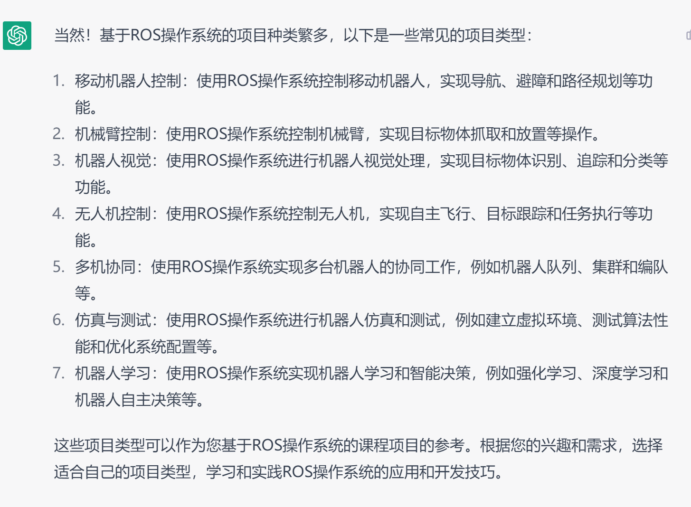

* (`Wikipedia`)	ROS是是一种分布式处理框架。这使可执行文件能被单独设计，并且在运行时松散耦合。这些过程可以封装到数据包（Packages）和堆栈（Stacks）中，以便于共享和分发。ROS还支持代码库的联合系统。使得协作亦能被分发。这种从文件系统级别到社区一级的设计让独立地决定发展和实施工作成为可能。上述所有功能都能由ROS的基础工具实现。
* `ROS`中的基本概念
  * **节点**(`node`)是指在ROS中运行的最小处理器单元，可以把它看作一个可执行程序。在ROS中，建议为一个目的创建一个节点，建议设计时注重可重用性。节点在运行的同时，向主节点注册节点的名称，并且还注册发布者（`publisher`）、订阅者（`subscriber`）、服务服务器（`service server`）、服务客户端（`service client`）的名称，且注册**消息形式**、**URI地址**和**端口**。基于这些信息，每个节点可以使用话题和服务与其他节点交换消息。
  * **主节点**(`master`)负责节点到节点的连接和消息通信，当你运行主节点时，可以注册每个节点的名字，并根据需要获取信息。
  * **消息**(`message`):节点之间通过消息来发送和接收数据。消息是诸如`integer、floating point`和`boolean`等类型的变量。用户还可以使用诸如消息里包括消息的**简单数据结构**或列举消息的消息数组的结构。
  * **话题**(`topic`)就是"故事"。在**发布者**（`publisher`）节点关于"故事"向主节点注册之后，它以**消息**形式发布关于该故事的广告。希望接收该故事的**订阅者**（`subscriber`）节点获得在主节点中以这个**话题**注册的那个发布者节点的信息。基于这个信息，**订阅者节点直接连接到发布者节点，用话题发送和接收消息。**
  * **服务**(`service`)消息通信是**服务客户端**（`service client`）与**服务服务器**（`service server`）之间的同步双向消息通信。其中服务客户端请求对应于特定目的任务的服务，而服务服务器则负责服务响应。
* `ROS`通信机制
  * **话题通信**
  * **服务通信**

* `ROS`的主要特点
  * 点对点设计
    * `ROS`通过点对点设计以及服务和节点管理器等机制可以分散实时计算压力
  * 不依赖编程语言
    * `ROS`支持多种现代高级编程语言
  * 精简、模块化、容易集成
  * 便于测试
  * 强大的库

>ROS并不是一个操作系统，而是编写机器人软件程序的一种具有高度灵活性的软件架构。它的实时性全部由它运行在其上的操作系统实现。 可以寻找一个实时性的操作系统将ROS运行在其上。

> ROS可以分成**两层**，低层是上面描述的操作系统层，高层则是广大用户群贡献的实现不同功能的各种**软件包**，例如定位绘图，行动规划，感知，模拟等等

> 问`gpt4`基于`ROS`的操作系统项目，如下：

> 其中**移动机器人控制**、**机器人视觉**、**多机协同**、**仿真与测试**是可选方向。
>
> 具体内容有待进一步探讨。

## 参考

[ROS官网](https://www.ros.org/)

[Q&A about ROS](https://answers.ros.org/questions/)

[关于ROS介绍1](https://blog.csdn.net/gezongbo/article/details/119790219)

[关于ROS介绍2](https://zhuanlan.zhihu.com/p/333792663)

[ROS通信机制](https://zhuanlan.zhihu.com/p/366774050)

[OSH-2022类似的一个项目](https://github.com/OSH-2022/x_do_our_best)

