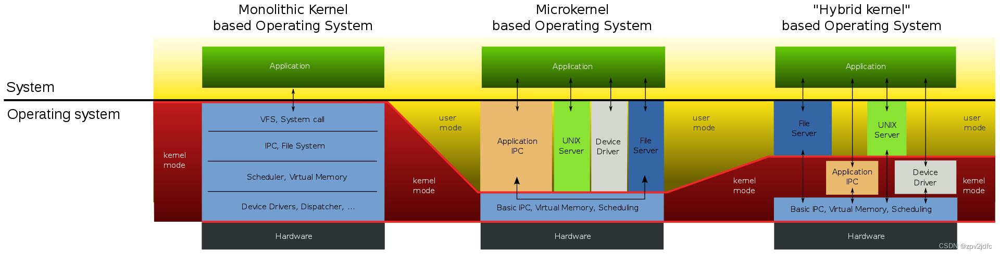

# 选题方向初调研（23/03/16）

## 可选范围(摘自PPT)

> 分布式OS
> 移动式OS：如Android
> 实时OS：如ucos freeRTOS
> 机器人操作系统：如ROS
> 分布式文件系统：如DFS
> 内存管理/虚拟化

## 我们可以做的事——

> 写内核
> 优化
> 分布式文件 存储 计算
> 硬件相关
> 安全相关
> 人机交互
> 内存管理/虚拟化
> 进程通信

## 个人调研

### 人机接口：AR  眼动  体感/手势

### 物联网操作系统：

要求：支持物联网硬件  轻量级  嵌入式系统 

[现有操作系统：](https://blog.csdn.net/unsv29/article/details/107894553?ops_request_misc=%257B%2522request%255Fid%2522%253A%2522167885132116800182761790%2522%252C%2522scm%2522%253A%252220140713.130102334..%2522%257D&request_id=167885132116800182761790&biz_id=0&utm_medium=distribute.pc_search_result.none-task-blog-2~all~sobaiduend~default-3-107894553-null-null.142^v73^insert_down3,201^v4^add_ask,239^v2^insert_chatgpt&utm_term=%E7%89%A9%E8%81%94%E7%BD%91%20%E6%93%8D%E4%BD%9C%E7%B3%BB%E7%BB%9F%20&spm=1018.2226.3001.4187)
1. FreeRTOS 
2. LiteOS
3. Linux裁剪：RT Linux   uClinux
4. AliOS Things  

### 可定制手机操作系统？？

### 汉字操作系统

## 2022OSH项目参考

|组名|方向|内容|
|:--:|:--:|:--:|
|[x-WowKiddy](https://github.com/OSH-2022/x-WowKiddy)|分布式数据平台|图像 视频在线共享|
|[x-runikraft](https://github.com/OSH-2022/x-runikraft)|unikernal|在RISC-V架构上运行的RUST unikernal?|
|[x-QvQ](https://github.com/OSH-2022/x-QvQ)|树莓派内核|语言安全在内核开发中的作用|
|[VR-fancy-office](https://github.com/OSH-2022/VR-fancy-office)|VR系统|导入 控制 操作3D文件|
|[x-NooBirds](https://github.com/OSH-2022/x-NooBirds)|实时操作系统|智能交通系统多个物理终端实时调度|
|[x-realism](https://github.com/OSH-2022/x-realism)|内核|注重性能、并发和安全的微内核操作系统|
|[x-DelayNoMore](https://github.com/OSH-2022/x-DelayNoMore)|分布式系统|基于ROS|
|[x-TOBEDONE](https://github.com/OSH-2022/x-TOBEDONE)|分布式系统|分布式图文件系统|
|[x_do_our_best](https://github.com/OSH-2022/x_do_our_best)|嵌入式系统|基于ROS|

# 移动操作系统调研（23/03/18）

## Android
[源代码](https://www.androidos.net.cn/sourcecode)

[入门指南](http://gityuan.com/android/)

### 可以做的事
- 优化
- 不同ROM之间的比较
- 摄像头实时动态手势识别
- Android 可使用adb命令的终端

($\downarrow$不开源)
~~Android桌面系统~~

~~[JideOS](http://www.jide.com/m/jideos.html)~~

~~Phoenixos OS~~

~~Chrome OS~~

# ROS具体题目调研（23/03/25）

## OSH-2022-x_do_our_best
> 实时内核RT-Thread+ROS
> stm32
> 小车复杂任务+多车调度

展望：
  - 实时+Linux混合内核+ROS
  - 分布式集群节点

## OSH-2022-x_NooBirds
> 实时Linux + 树莓派
> 多个物理终端实时调度
> 多种调度算法比较

展望：
  - 小车对控制命令响应的延迟
  - 不同终端直接通信
  - 离线调度

## OSH-2022-x_DelayNoMore

> ROS2+Ray 分布式计算

## 官方文档
[Demo](https://github.com/ros2/demos)

## ？？
- 进程通信

- 计算

- 硬件相关

# 三个备选题目调研（23/03/28）
本人负责已有的相关项目资料整理

## 无人机集群调度
- [基于ROS1节点多机协同](https://blog.csdn.net/msq19895070/article/details/106719404/?utm_medium=distribute.pc_relevant.none-task-blog-2~default~baidujs_utm_term~default-0--blog-109147642.235^v27^pc_relevant_multi_platform_whitelistv3&spm=1001.2101.3001.4242.1&utm_relevant_index=3)
  - Ubuntu + ROS1 + WIFI路由器
  - 成果：实现10台以下无人机飞行编队
  - 改进方向：
    > “ROS2的推出，支持了无中心节点的通信方式DDS,软件通信层面没有中心点这一说，稳定性大为提升，在软件的消息通信层面，是非常适合组网的群体智能，因为ROS2推出不久，后续还是非常值得研究的。尤其是真正的分布式运行DDS的模式。”
    > “如果想容纳更多的无人系统，那么消息流要精简，和选择通信带宽更高的硬件设备。理论上一个网段的局域网可以容纳255台设备。”
- [OSH-2022-x_NooBirds](https://github.com/OSH-2022/x-NooBirds)
  - 实时Linux + 树莓派
  - 成果：多个无人车实时调度
  - 对比多种调度算法实际效果
  - 改进方向：
    > 硬件导致的响应延时
    > 通信结构由主从变为平行
    > 离线调度

- [飞思实验室（思路）](https://blog.csdn.net/FEISILAB_2022/article/details/125779979?ops_request_misc=%257B%2522request%255Fid%2522%253A%2522168001345916800227488918%2522%252C%2522scm%2522%253A%252220140713.130102334.pc%255Fall.%2522%257D&request_id=168001345916800227488918&biz_id=0&utm_medium=distribute.pc_search_result.none-task-blog-2~all~first_rank_ecpm_v1~rank_v31_ecpm-3-125779979-null-null.142^v76^insert_down38,201^v4^add_ask,239^v2^insert_chatgpt&utm_term=ROS%20%E6%97%A0%E4%BA%BA%E6%9C%BA%E5%8D%8F%E5%90%8C&spm=1018.2226.3001.4187)
   > “通过Matlab/simulink与ROS环境的算法开发环境，支持多无人机集群控制算法开发与调试，提供完善的代码编辑、运行调试等功能。基于ROS标准开发，通过集群数据链接收定位系统发送的无人机的六自由度位姿信息，转换为无人机定位所需要的格式（欧拉角/四元数转换，坐标系转换），支持Matlab调用。通过集群数据链接收无人机的姿态及状态数据，转换成ROS主题消息，供ROS节点程序使用。无人机控制接口软件可接收ROS节点发布的控制指令信息（支持位置控制指令、速度控制指令、航向控制指令），转换成Mavlink消息发送给无人机。飞行控制软件基于Matlab/Simulink开发，软件分别运行在无人机飞控、与地面控制端平台实现多无人机的集群控制。能获取各无人机的位姿，发送控制指令实现无人机编队协同。可实现多无人机集群顺序编队圆周编队飞行，多无人机集群顺序编队立体“8”字编队飞行，多无人机集群顺序编队主从跟随，多无人机集群“△”编队飞行，多无人机集群“△-□-○”队形变换。”

## 混合内核

## 智能交通系统-plus
- [OSH-2022-x_NooBirds](https://github.com/OSH-2022/x-NooBirds)
  - 实时Linux + 树莓派
  - 成果：无人车位置测量、路线规划、路口防撞、防追尾
  - 对比多种调度算法实际效果
  - 改进方向：
    > 硬件导致的响应延时
    > 通信结构由主从变为平行
    > 离线调度

- ideas
    > 停车场
    > 紧急事件
    > 拼车载客路线/公共交通

# 调研报告内容整理-Part2&4 （23/04/03）

查询数据传输至cache的指令以及支持的cpu型号

硬件支持+操作系统
## 指令及CPU型号

> 网卡与操作系统的交互一般有两种方式:
> 一种是中断（IRQ，网卡在收到了网络信号之后，主动发送中断到CPU，而CPU将会立即停下手边的活以便对这个中断信号进行分析），
另一种叫DMA（Direct Memory Access, 也就是允许硬件在无CPU干预的情况下将数据缓存在指定的内存空间内，在CPU合适的时候才处理）
### linux--网卡
- `ifconfig`:手动启动、观察与修改网络接口的相关参数
- `ifup`/`ifdown`:搜索设置文件（ifcfg-ethx）来进行启动与关闭网络接口的相关参数

### linux--DMA
- [API](https://zhuanlan.zhihu.com/p/496060255)

## 硬件支持+操作系统

### 网卡
### 上位机(运行平台)
[一个整合了相关硬件的教程网站-微雪课堂](https://www.waveshare.net/study/portal.php)

- 虚拟机
  - 考验电脑性能
- 树莓派
  - 简介：它是一款基于ARM的微型电脑主板，以SD/MicroSD卡为内存硬盘，卡片主板周围有1/2/4个USB接口和一个10/100 以太网接口（A型没有网口），可连接键盘、鼠标和网线，同时拥有视频模拟信号的电视输出接口和HDMI高清视频输出接口，以上部件全部整合在一张仅比信用卡稍大的主板上，具备所有PC的基本功能
  - [可运行的Ubuntu操作系统](https://ubuntu.com/download/raspberry-pi)
  > Ubunto XXX 22.04
  - CPU型号： Broadcom BCM2711，四核Cortex-A72（ARM v8）64位SoC @ 1.5GHz
- Jetson Nano
  - 简介： 是NVIDIA 公司研发的基于 GPU处理器的嵌入式开发板，支持目前TensorFlow，Caffe/Caffer2,PyTorch,keras 等流行的 AI 框架和算法
  - 预装Ubuntu 18.04LTS系统,有安装20.04的[教程](https://qengineering.eu/install-ubuntu-20.04-on-jetson-nano.html)
  - CPU型号：四核ARM Cortex-A57 MPCore处理器@ 1.43GHz

- 比较
  - 算力：树莓派< Jetson Nano
  - 价格相当

### 下位机(控制对象):视具体项目决定
- STM32
- Arduino:入门快，难度较小

### 操作系统 

ROS目前只能在基于Unix的平台上运行。ROS的软件主要在Ubuntu和Mac OS X 系统上测试，同时ROS社区仍持续支持Fedora，Gentoo，Arch Linux和其它Linux平台。

#### ROS版本

- ROS1
  - ~~MELODIC MORENIA~~
    - 支持到2023/05
    - 推荐OS:Ubuntu 18.04
  - NOETIC NINJEMYS(Recommended)
    - 支持到2025/05
    - Ubuntu Linux - Focal (20.04)
    - Debian Linux - Buster (10)
- ROS2
  - ~~FOXY FITZROY~~
  - HUMBLE HAWKSBILL(Recommended)
    - [安装教程](https://docs.ros.org/en/humble/Installation.html)
    - Ubuntu Linux - Jammy (22.04) 64-bit
    - Ubuntu Linux - Focal (20.04) 64-bit
    - Debian Linux - Bullseye (11) 64-bit
    - Win10 VS2019
    - RHEL 8 64-bit
    - macOS Mojave (10.14)
  - ROLLING RIDLEY(In Development)
    - Ubuntu Linux - Jammy (22.04) 64-bit
    - Win10 VS2019
    - RHEL 8 64-bit

## 参考资料
- [ROS不同版本官方文档](http://docs.ros.org/)
- [ROS小车：硬件和软件介绍](https://blog.csdn.net/qq_44275286/article/details/101944058)
- [JetsonNano性能参数](https://www.nvidia.cn/autonomous-machines/embedded-systems/jetson-nano/education-projects/)
- [ros智能小车硬件介绍](https://blog.csdn.net/baidu_23831861/article/details/109112614?spm=1001.2101.3001.6650.3&utm_medium=distribute.pc_relevant.none-task-blog-2%7Edefault%7ECTRLIST%7ERate-3-109112614-blog-127877337.235%5Ev27%5Epc_relevant_multi_platform_whitelistv3&depth_1-utm_source=distribute.pc_relevant.none-task-blog-2%7Edefault%7ECTRLIST%7ERate-3-109112614-blog-127877337.235%5Ev27%5Epc_relevant_multi_platform_whitelistv3&utm_relevant_index=6)
- [linux网口设置指令](https://blog.csdn.net/lu_embedded/article/details/53215324)
- [网卡中断与CPU绑定](https://www.cnblogs.com/bamanzi/p/linux-irq-and-cpu-affinity.html)
- [linux DMA API 使用指导](https://zhuanlan.zhihu.com/p/496060255)