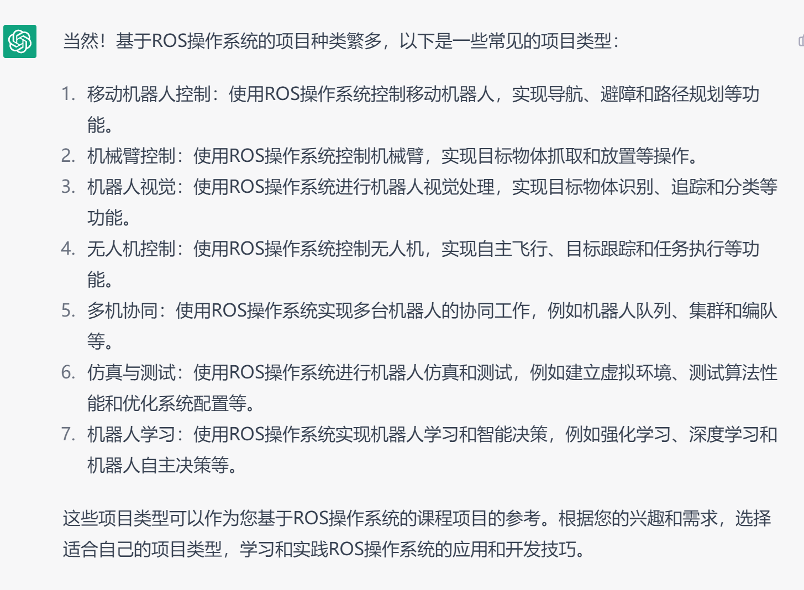

# 关于ROS的初步调研

* (`Wikipedia`)	ROS是是一种分布式处理框架。这使可执行文件能被单独设计，并且在运行时松散耦合。这些过程可以封装到数据包（Packages）和堆栈（Stacks）中，以便于共享和分发。ROS还支持代码库的联合系统。使得协作亦能被分发。这种从文件系统级别到社区一级的设计让独立地决定发展和实施工作成为可能。上述所有功能都能由ROS的基础工具实现。
* `ROS`中的基本概念
  * **节点**(`node`)是指在ROS中运行的最小处理器单元，可以把它看作一个可执行程序。在ROS中，建议为一个目的创建一个节点，建议设计时注重可重用性。节点在运行的同时，向主节点注册节点的名称，并且还注册发布者（`publisher`）、订阅者（`subscriber`）、服务服务器（`service server`）、服务客户端（`service client`）的名称，且注册**消息形式**、**URI地址**和**端口**。基于这些信息，每个节点可以使用话题和服务与其他节点交换消息。
  * **主节点**(`master`)负责节点到节点的连接和消息通信，当你运行主节点时，可以注册每个节点的名字，并根据需要获取信息。
  * **消息**(`message`):节点之间通过消息来发送和接收数据。消息是诸如`integer、floating point`和`boolean`等类型的变量。用户还可以使用诸如消息里包括消息的**简单数据结构**或列举消息的消息数组的结构。
  * **话题**(`topic`)就是"故事"。在**发布者**（`publisher`）节点关于"故事"向主节点注册之后，它以**消息**形式发布关于该故事的广告。希望接收该故事的**订阅者**（`subscriber`）节点获得在主节点中以这个**话题**注册的那个发布者节点的信息。基于这个信息，**订阅者节点直接连接到发布者节点，用话题发送和接收消息。**
  * **服务**(`service`)消息通信是**服务客户端**（`service client`）与**服务服务器**（`service server`）之间的同步双向消息通信。其中服务客户端请求对应于特定目的任务的服务，而服务服务器则负责服务响应。
* `ROS`通信机制
  * **话题通信**
  * **服务通信**
* `ROS`的主要特点
  * 点对点设计
    * `ROS`通过点对点设计以及服务和节点管理器等机制可以分散实时计算压力
  * 不依赖编程语言
    * `ROS`支持多种现代高级编程语言
  * 精简、模块化、容易集成
  * 便于测试
  * 强大的库

>ROS并不是一个操作系统，而是编写机器人软件程序的一种具有高度灵活性的软件架构。它的实时性全部由它运行在其上的操作系统实现。 可以寻找一个实时性的操作系统将ROS运行在其上。

> ROS可以分成**两层**，低层是上面描述的操作系统层，高层则是广大用户群贡献的实现不同功能的各种**软件包**，例如定位绘图，行动规划，感知，模拟等等

> 问`gpt4`基于`ROS`的操作系统项目，如下：

> 其中**移动机器人控制**、**机器人视觉**、**多机协同**、**仿真与测试**是可选方向。
>
> 具体内容有待进一步探讨。

## 参考

[ROS官网](https://www.ros.org/)

[Q&A about ROS](https://answers.ros.org/questions/)

[关于ROS介绍1](https://blog.csdn.net/gezongbo/article/details/119790219)

[关于ROS介绍2](https://zhuanlan.zhihu.com/p/333792663)

[ROS通信机制](https://zhuanlan.zhihu.com/p/366774050)

[OSH-2022类似的一个项目](https://github.com/OSH-2022/x_do_our_best)

# 3.27会议之后关于硬件的一些调研

* 小车项目(选用嵌入式开发系统作为OS)
  * 需要一个开发板(如**STM32嵌入式开发板**)来运行OS
  * 小车运动，需要联网(ESP8266固件)

* 树莓派
  * 嵌入式Linux板卡，上面可以运行 Linux 系统，同时它提供了很多可编程的GPIO用于扩展硬件

* K210(一种MCU，算力很可观)

  * 官方开发板套件-KD233
  * Widora-AIRV2/BITK210开发板套件

* 实验载体(比如小车、无人机)
* [小车产品](http://www.autolabor.com.cn/index)
  * **Autolabor PM1**是由清华大学无人车团队搭载的一款远程安防巡逻平台，包含巡逻机器人、远程驾驶台云端管理系统，已实现了4G/5G/Wi-Fi远程驾驶、实时高清图像传输、远程对话、语音提醒等功能
  * **Autolabor Pro 1**现已实现2D/3D SLAM导航，定位标签循迹，室外RTK循迹，路径规划，自动避障，远程遥控等功能
  * **Autolabor2.5**在硬件上采用Raspberry Pi 3b开发板为核心处理单元，其提供的4个USB接口可以方便搭载各种传感器设备
* [一个项目](https://github.com/kmakise/AGV_little_C1)

# ROS2的进一步调研

##  ROS2的官方文档

[中文版](http://dev.ros2.fishros.com/doc/index.html)

[ROS2 design](http://design.ros2.org/)

* 每个**节点**负责单个模块

  

* **话题**：充当节点交换信息的总线，基于发布者-订阅者模型

* **服务**：服务基于调用和响应模型

* **参数**：参数是节点的配置
* **行为**：由三部分组成，即：目标、反馈和结果。
  * 允许执行长时间运行任务
  * 建立在**服务**和**话题**上
  * 可抢占
  * 基于客户端-服务器模型，“动作客户端” 节点向 “动作服务器” 节点发送目标，该节点确认目标并返回反馈流和结果

* **客户端库**：允许使用不同编程语言编写的节点进行通信，如**rclcpp = C++客户端库** 	**rclpy = Python客户端库**

***

* 关于ROS2接口
  * 通常通过**消息**、**服务**、**动作**之一的接口通信。ROS2使用接口定义语言 (IDL) 来描述这些接口，使得ROS工具轻松地以多种目标语言自动生成接口类型的源文件
    * msg（消息）: `.msg` 文件是描述ROS消息字段的简单文本文件。它们用于为不同语言的消息生成源文件代码
    * srv（服务）: `.srv` 文件描述了一项服务。它们由两部分组成: 请求和响应。请求和响应是消息声明
    * 动作（action）: `.action` 文件描述动作。它们由三部分组成: 目标、结果和反馈。每个部分本身都是一个消息声明
  * **话题**用于连续数据流，数据可以在任何时间独立于任何发送者/接收者发布和订阅
  * **服务**用于快速终止的远程过程调用，不应该用于运行时间较长的进程，特别是，如果发生特殊情况，可能需要抢占的过程。并且它们永远不应改变或依赖于状态，以避免对其他节点产生不必要的副作用
  * **动作**用于移动机器人或运行更长时间但在执行过程中提供反馈的任何离散行为

***

## ROS2与ROS1区别

* [ROS2与ROS的区别](https://zhuanlan.zhihu.com/p/466267968#:~:text=ROS2%3A%20%E5%BC%95%E5%85%A5%E4%BA%86%E6%95%B0%E6%8D%AE%E5%88%86%E5%8F%91%E6%9C%8D%E5%8A%A1%EF%BC%88data%20distribution,service%EF%BC%8C%20DDS%EF%BC%89%E9%80%9A%E4%BF%A1%E5%8D%8F%E8%AE%AE%EF%BC%8C%E5%8F%AF%E4%BB%A5%E4%BB%A5%E9%9B%B6%E6%8B%B7%E8%B4%9D%E7%9A%84%E6%96%B9%E5%BC%8F%E4%BC%A0%E9%80%92%E6%B6%88%E6%81%AF%EF%BC%8C%E8%8A%82%E7%9C%81%E4%BA%86CPU%E5%92%8C%E5%86%85%E5%AD%98%E8%B5%84%E6%BA%90%EF%BC%8C%E5%90%8C%E6%97%B6%E5%A2%9E%E5%8A%A0%E9%80%9A%E8%AE%AF%E7%9A%84%E5%AE%9E%E6%97%B6%E6%80%A7%EF%BC%9B%20%E5%90%84%E4%B8%AA%E8%8A%82%E7%82%B9%E5%8F%AF%E4%BB%A5%E7%9B%B4%E6%8E%A5%E9%80%9A%E8%BF%87DDS%E8%BF%9B%E8%A1%8C%E8%8A%82%E7%82%B9%E9%80%9A%E8%AE%AF%EF%BC%8C%E6%AF%8F%E4%B8%AA%E8%8A%82%E7%82%B9%E9%83%BD%E6%98%AF%E5%B9%B3%E7%AD%89%E7%9A%84%EF%BC%8C%E5%8F%AF%E4%BB%A51%E5%AF%B91%E3%80%811%E5%AF%B9%E5%A4%9A%EF%BC%8C%E5%A4%9A%E5%AF%B9%E5%A4%9A%E8%BF%9B%E8%A1%8C%E4%BA%92%E7%9B%B8%E9%80%9A%E4%BF%A1%E3%80%82)
* [ROS2的动机与设计](https://www.science.org/doi/10.1126/scirobotics.abm6074)
* [ROS2的机制、优势](https://zhuanlan.zhihu.com/p/398213486)
* **来自某论文**

| **类别**         |          **ROS 1**          |                **ROS 2**                |
| :--------------- | :-------------------------: | :-------------------------------------: |
| **网络传输**     | 基于 TCP/UDP 构建的定制协议 | 现有标准 （DDS）， 抽象支持添加其他标准 |
| **网络架构**     |  中央名称服务器（roscore）  |               点对点发现                |
| **平台支持**     |          Linux目录          |         Linux、Windows 和 macOS         |
| **客户端库**     |     以每种语言独立编写      |         共享公共基础C库 （rcl）         |
| **节点与进程**   |      每个进程一个节点       |            每个进程多个节点             |
| **线程模型**     |     回调队列和处理程序      |              可交换执行器               |
| **节点状态管理** |            没有             |              生命周期节点               |
| **嵌入式系统**   | 最少的实验支持（rosserial） |        商业支持的实施 （微 ROS）        |
| **参数访问**     | 基于 XMLRPC 构建的辅助协议  |            使用服务调用实现             |
| **参数类型**     |      分配时推断的类型       |          声明和强制执行的类型           |

## ROS2通信的优化

[鱼香社区](https://fishros.org.cn/forum/category/22/ros2) 

* [ROS节点间实现零拷贝通信](https://fishros.org.cn/forum/topic/494/ros2%E8%8A%82%E7%82%B9%E9%80%9A%E4%BF%A1%E5%AE%9E%E7%8E%B0%E9%9B%B6%E6%8B%B7%E8%B4%9D)
  * [简单易懂的零拷贝通信原理](https://zhuanlan.zhihu.com/p/447890038)
* [ROS2调度策略](https://zhuanlan.zhihu.com/p/404067881)

## 实时性

[2016年的article](http://design.ros2.org/articles/realtime_background.html)

* 实时计算的定义需要定义其他几个关键术语：
  * **确定性**：如果系统始终为已知输入产生相同的输出，则系统是确定性的。 非确定性系统的输出将具有随机变化。
  * **截止日期**：截止日期是必须完成某项任务的有限时间窗口。
  * **服务质量**：网络的整体性能。 包括带宽、吞吐量、可用性、抖动、延迟和错误率等因素。

* 实时环境的一些示例：
  * Linux 内核补丁，将 Linux 调度程序修改为完全抢占。`RT_PREEMPT`
  * Xenomai，一个符合POSIX的协内核（或虚拟机监控程序），提供与Linux内核协作的实时内核。 Linux 内核被视为实时内核调度程序的空闲任务（优先级最低的任务）。
  * RTAI，一种替代的协内核解决方案。
  * QNX Neutrino，一款符合 POSIX 标准的实时操作系统，适用于关键任务系统。

# 项目调研

## 对2019项目的调研

* 网卡：网络接口卡（network interface card），也叫NIC卡，是一种允许网络连接的计算机硬件设备。指能使计算机和服务器等网络设备相互连接的电路板。
  * 构造
    * **控制器**：用来处理接收到的数据
    * **boot ROM槽**：boot ROM可使无磁盘工作站连接到网络，在提高安全性的同时降低硬件成本
    * **网卡端口**：该端口直接与以太网线或光模块连接，产生和接收网线或光纤跳线上的电信号。
    * **总线接口**
* 沙盒(sandbox)：为运行中的程序提供的隔离环境。通常是作为一些**来源不可信、具破坏力或无法判定程序意图的程序**提供实验之用。Windows 沙盒提供了轻型桌面环境，可以安全地在隔离状态下运行应用程序。
* [eBPF简介](https://ebpf.io/what-is-ebpf/)

### **未完待续**

# QEMU

> [QEMU介绍](https://zhuanlan.zhihu.com/p/72484589)

由于将小车(以及其他的实体硬件设备)作为测试实时性的载体有难度，且与操作系统课程的核心内容无关，故本小组决定在`QEMU`上跑出一段`benchmark`程序

## What is QEMU

* `QEMU`是可执行**硬件虚拟化**(对计算机/操作系统的虚拟)的(hardware virtualization)开源仿真器(Emulator)。`QEMU`是一个托管的虚拟机，它通过动态的二进制转换，模拟CPU，并且提供一组设备模型，使它能够运行多种未修改的客户机OS，可以通过与KVM一起使用进而接近本地速度运行虚拟机(接近真实电脑的速度)。

* 由于`QEMU`是纯软件实现的，所有的指令都需要`QEMU`转手，因此性能很低。配合`KVM`(基于内核的虚拟机，主要负责比较繁琐的CPU、内存虚拟化)来完成虚拟化是一种常用的解决方式，`QEMU`主要负责I/O的虚拟化。

  

* `QEMU` 软件虚拟化实现的思路是采用二进制指令翻译技术，主要是提取 guest 代码，然后将其翻译成 TCG(微型代码生成器) 中间代码，最后再将中间代码翻译成 host 指定架构的代码

  

* 本质上，虚拟出的每个虚拟机对应 host 上的一个 `QEMU` 进程，而虚拟机的执行线程（如 CPU 线程、I/O 线程等）对应` QEMU`进程的一个线程

* `QEMU`主要有两种模式
  * 用户模式
    * 在这种模式下，`QEMU`可以模拟一个虚拟的CPU和一些基本的设备，如串口、网卡等。可以运行基于不同CPU体系结构的用户程序，因此它可以用于交叉编译和调试。
  * 系统模式
    * 在这种模式下，`QEMU`模拟一个完整的计算机系统，包括外围设备。可以实现许多客户机OS的引导。

# 论文阅读

## Direct Cache Access for High Bandwidth Network I/O 

* `Abstract`
  * `DCA`显著减少接收密集型网络I/O的**内存延迟和内存带宽**
* `Introduction`
  * I/O对处理器效率的影响可以用10千兆以太网标准和执行TCP/IP协议所涉及的处理来演示。
  * 使用`DCA`尽量减少对内存子系统的依赖，改善处理和I/O能力之间的平衡
* `TCP/IP Example `
  * `DCA`在传输密集型工作负载中的适用性有限，只能在传输操作完成后消除处理器对内存的网卡状态的读取

* `Memory Access Profiles of Benchmarks`

  * 测试的一些方法/标准？
    * 磁盘I/O 与 网络I/O？
  * 为了从直接放置在cache中的I/O数据获益，processor必须及时从cache中读取数据。否则，修改后的高速缓存行可能会在被读取之前被驱逐到内存中。In  addition, the cache is subjected to two replacements  instead of one – first, when placing the I/O data in the cache and second, due to untimely placement, when the  processor misses the cache anyway.
  * DCA可以减少很大一部分的cache misses(缓存未命中，explain:当发生缓存未命中时，系统或应用程序会继续在底层数据存储中定位数据，这会增加请求的持续时间。通常，系统可能会将数据写入缓存，再次增加延迟，尽管该延迟会被缓存对其他数据的命中所抵消。)

  

  

  * 大量传入的网络I/O流量是使用DCA大幅提高性能的前兆,如果I/O的写入数据直接放在处理器的高速缓存中，这一特性可直接减少网络I/O的未命中
  * 处理器数据读取是很重要的带宽组成部分，也是重要的内存延迟停滞来源。DCA可以降低数据读取`Miss`的情况

* `System Considerations `

  * 缓存越小，与I/O相关的cache misses就越小，DCA的好处就越小

  * 缓存空间受限时，DCA可能会因为过早地将数据带入缓存而引起I/O干扰效应。这种影响可通过将与I/O相关的分配限制在一个高速缓存的方式处理
  * **5.4:**`A Reference Model for DCA`
    * `NUMA（非统一内存访问）`

## Using Direct Cache Access Combined With Integrated NIC  Architecture to Accelerate Network Processing 

* `DCA与INIC(集成网络接口卡)`相结合的方式减少与I/O相关的数据传输延迟

* `Network Processing Flow `
  * 网络处理的时间成本：**中断处理、网卡驱动、堆栈处理、内核程序**(数据包成本)、数据复制、校验计算等(数据触摸成本，与I/O数据大小成比例)

* **改进的DCA**

  * 修改缓存策略和系统结构，将DCA请求和非DCA请求分开

  * 在系统中建立特定内存地址空间接收DCA传输的数据

* DCA method is more promising in reducing memory accessing cost than improving the I/O  transfer. 

* 结论：只有DCA不能大幅减少I/O和内存的流量，在现有的缓存策略下仍然会在缓存和内存系统之间产生数据传输。INIC有助于数据传输(减少数据传输延迟和穿越I/O桥的I/O流量)。使用DCA发送至缓存的数据不应大于缓存大小的1/4 ，否则会产生大量的cache pollution，导致系统i性能下降。DCA在减少内存访问延迟方面比减少I/O延迟更有希望。