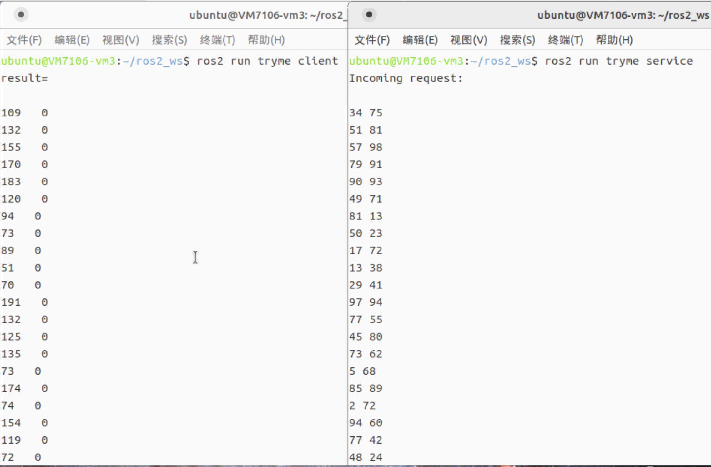

## 自建Package-interfaces

1. 创建新的Package 
```bash
ros2 pkg create --build-type ament_cmake my_interfaces
```
（默认为C语言编译）

2. 在目录下创建`srv`文件夹，创建新的服务

```bash
mkdir srv
gedit AddTwoMatrix.srv
```
AddTwoMatrix.srv内容如下：

> int64[] a
> int64[] b
> ---
> int64[] sum

3. 编译并测试

    - 在CmakeList.txt中添加
        ```
        rosidl_generate_interfaces(${PROJECT_NAME}
          "srv/AddTwoMatrix.srv"
        )
        ```
    - 编译
        ```
        colcon build --packages-select my_interfaces
        ```

    - 更新后测试
        ```
        ros2 interface show tutorial_interfaces/srv/AddTwoMatrix
        ```

        输出AddTwoMatrix.srv内容


## 调用srv运行程序

在新Package里引用(.py)
    ```
        from my_interfaces.srv import AddTwoMatrix
    ```

编译、运行过程同[1_创建ros2工作区以及运行简单程序](./1_创建ros2工作区以及运行简单程序.md)

(service中每行输出`a[i] b[i]`，client中每行输出`result[i] result[i]-a[i]-b[i]`)



