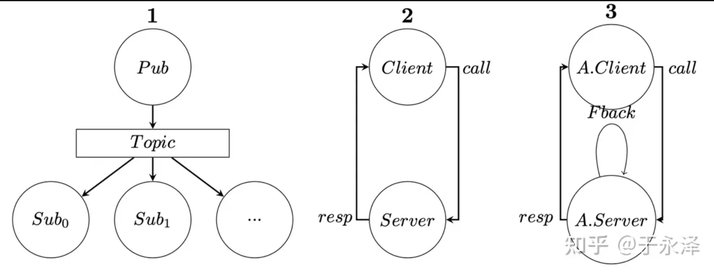
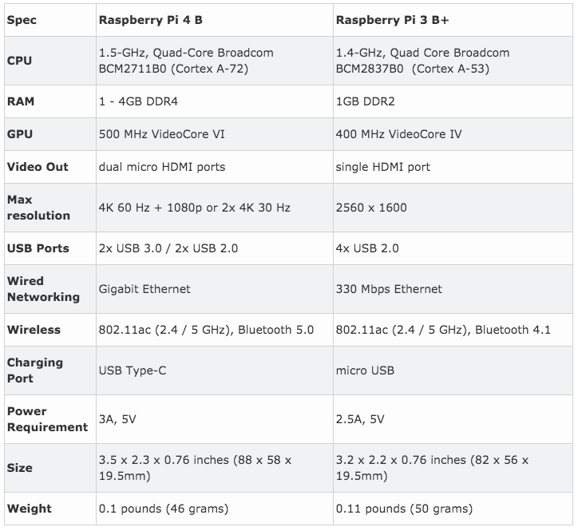

# 调研报告

**初定方向：** 基于`ROS2`的操作系统实时性优化 

## 小组成员

* 王润泽
* 王道宇
* 封霁芩
* 陈应豪
* 王昱

## 项目背景

#### 时代背景：无人驾驭安全性问题

- 近年来，无人驾驶事故频发，安全性问题已经成为了制约无人驾驶大规模铺设的瓶颈之一。这里有一个典型的例子是：特斯拉在2020年6月台北仙桃发生的事故，车辆在开启自动驾驶的状态下毫无减速的撞上卡车。
  
  
  
  人身安全至关重要，正因为如此，无人车驾驶的安全问题理应排在首位。要解决像上述的安全问题，一个非常重要的方向就是提高操作系统的实时性。

#### 发展现状

- **百度Apollo**
  
  > 百度Apollo是百度公司推出的自动驾驶开放平台。该平台具备包括感知、定位、规划、控制等多个模块，可支持L2~L4级别的自动驾驶功能，同时，百度还提供了基于Apollo平台的自动驾驶解决方案，如Apollo Go Robotaxi等，已经在多个城市进行了测试和落地应用。
  
  Apollo平台基于ROS开发，但是对通信机制部分进行了众多改变，使得Apollo平台的实时性得到了大幅提升。Apollo平台的实时性优化主要体现在以下几个方面：
  
  - **去中心化**，也就是去掉ROS Master，这部分使用了DDS技术。
  - 使用**共享内存**的方法，优化大数据传输的瓶颈。
  - 使用Protobuf优化数据格式的兼容性。

#### 操作系统实时性问题

- 目前计算机主流的方式是将文件读入后先拷贝到内存中，再通过数次拷贝进入cache。等到文件处理完成后，依然需要经过多次拷贝。通过DMA技术和局部性原理，可实现数据0拷贝，降低数据传输消耗的时间，以提升操作系统的实时性。

#### ROS的具体任务

- 基于树莓派的ROS小车任务。

- 无人车的避障工作。（对时间延迟要求较高）

## 立项依据及理论知识

### ROS2

* `ROS`(`Robot Operating System`，机器人操作系统)，是专为机器人软件开发所设计出来的一套电脑操作系统架构。它提供类似于操作系统的服务，包括硬件抽象描述、底层驱动程序管理、共用功能的执行、程序间消息传递、程序发行包管理，它也提供一些工具和库用于获取、建立、编写和执行多机融合的程序。事实上，`ROS`并不是一个操作系统，而是编写机器人软件程序的一种具有高度灵活性的分布式软件架构。`ROS`可以分成两层：低层是操作系统层，高层是各类软件包。

#### ROS开发环境

- **gazebo**：一款免费的机器人仿真软件，提供高保真度的物理模拟，一整套传感器模型，以及对用户和程序非常友好的交互方式。能够在复杂的室内和室外环境中准确高效地模拟机器人工作的功能，通常与ROS联合使用，为开发者提供了优异的仿真环境。

#### ROS2中的重要概念

* **节点**：每个节点负责单个模块，**参数**是节点的配置。 
  * `ROS2`与`ROS`比较:`ROS`通过一个核心的`master`节点管理所有节点的通讯 ，如果`master`节点崩溃整个系统会出错；`ROS2`引入了`DDS`(`data distribution service`，数据分发服务)，各个节点可以通过`DDS`进行通信，可以**一对一、一对多、多对多**互相通信，增强了安全性、可靠性，同时提高了实时性。

* **话题**：作用是充当节点之间交换信息的总线，它是基于发布者-订阅者模型
  * 话题可以是**一对多、多对一、多对多**的(见下图)

* **服务**：服务是基于调用和响应模型的，它会向具体调用的客户端传递数据
  * 一个服务只能有一个服务端，但可以有多个客户端(见下图)

* **动作**：是由**目标、反馈、结果**三部分组成，是建立在话题、服务之上的。它基于客户端-服务器模型，客户端`NODE`向服务端`NODE`发送**目标**，服务端`NODE`返回**反馈流、结果**
  * 动作与服务类似，但是动作是**可抢占的**。

#### ROS2的通信机制

* ***Publish-Subscribe(1)***
  * ***Pub***通过Topic向***Sub***传递数据
  * 该机制常用于连续数据流，数据可以在任何时间独立于任何***Pub***/***Sub***发布和订阅
* ***Service-Client(2)***
  * ***Client***向***Server***发出请求，***Server***执行任务后将response返回给***Client***
  * 该机制常用于快速终止的远程过程调用，不应该用于运行时间较长的进程，特别是，如果发生特殊情况，可能需要抢占的过程。并且它们永远不应改变或依赖于状态，以避免对其他节点产生不必要的副作用
* ***Actions(3)***
  * 基于***Service-Client***，在执行任务时产生了多次Fback
  * 该机制常用于移动机器人或**运行更长时间但在执行过程中提供反馈的任何离散行为**

#### ROS2与ROS1的区别

* ROS1的不足
  * 仅支持Linux系统
  * 基于TCP/IP的通信方式，点对点的分布式通信机制，实时性差，系统开销大
  * 依赖于ROS master管理所有节点的通讯，稳定性差
  * 对Python3支持不友好
* ROS2的改进
  * 支持Linux、Windows、Mac OS、嵌入式RTOS等，跨平台特性得到改善
  * 引入DDS通信协议，可通过零拷贝的方式传递消息，节约CPU、内存的资源，实时性得到了很大的提升
    * DDS（Data Distribution Service）是一种面向实时通信的消息传递中间件技术，它允许不同设备之间进行实时的、可靠的数据交换。DDS旨在解决数据分发和通信问题，它支持多种编程语言和平台，并提供了高效、安全、可靠的数据交换方式。
    * DDS基于发布-订阅模式（Publish-Subscribe），允许多个发送者（Publishers）同时向多个接收者（Subscribers）广播数据，且能够自动进行数据交换的协商和管理。DDS可以提供实时性能，支持大量的数据量，同时具备高可靠性和安全性。
    * DDS与其他通信技术（如消息队列、WebSocket等）相比，具有更高的实时性、更可靠的通信、更强大的管理和更灵活的数据模型等优势，因此被广泛应用于需要高效实时通信的领域，如工业自动化、航空航天、医疗、智能交通等。
  * 去中心化：去除了ROS master中心节点管理器，节点地位平等，可以**一对一、一对多、多对多**互相通信，稳定性、可靠性得到了很大的提高
  * 支持Python3

### cache

- **程序如何运行？**
  
    程序是运行在`RAM`中的，`RAM`就是我们常说的`DDR`（`DDR3`、`DDR4`、`DDR5`），我们称之为主存`main memory`。当我们需要运行一个进程的时候，首先会从磁盘设备（例如，`eMMC`、`UFS`、`SSD`等）中将可执行程序`load`到主存中，然后开始执行。在`CPU`内部存在一堆的通用寄存器（`register`）。
  
    大概过程类似这样：
  
    
  
    但是由于`CPU`通用寄存器的速度和主存之间存在着太大的差异。两者之间的速度大致如下关系：
  
    
  
    在速度差了百倍的情况下，`CPU`对主存的`load/store`操作实际上都非常慢。但是试图提升主存的速度，又要考虑到现今主存动不动几个`GB`的容量，**成本可能过高**。因此产生了一个折中的办法，那就是制作一块速度极快但是容量极小的存储设备。那么其成本也不会太高，我们称之为`cache memory`，在硬件上我们将`cache`放置在`CPU`和主存**之间**，作为**主存数据**的缓存。
  
    当`CPU`试图从主存中`load/store`数据的时候， `CPU`会首先从`cache`中查找对应地址的数据是否缓存在`cache` 中。如果是，直接从`cache`中拿到数据并返回给`CPU`。当存在`cache`的时候，程序运行的流程将会变成如下:
  
    
  
    ***CPU和主存之间直接数据传输的方式转变成CPU和cache之间直接数据传输。cache负责和主存之间数据传输。***
  
  - 关于多级`cache`
    
    一级`cache`并没有满足人们对性能的要求，当cache中没有缓存我们想要的数据的时候，依然需要漫长的等待从主存中load数据。所以我们引入了三级`cache`，在刚刚提到的`L1 cache`之后再接上`L2 cache`，在`L2 cache`和主存之间再连接`L3 cache`。等级越高，速度越慢，容量越大。但是速度相比较主存而言，依然很快。不同等级`cache`速度之间关系如下：
    
    

- **cache**的部分操作
  
  - 外部设备I/O和DMA传输
    例如，在博通机顶盒平台中，内存加解密在单独的安全芯片中进行，安全芯片访问的数据通过**DMA**进行传输操作。因此，在进行内存加解密前，需要**flush D-Cache**操作将数据同步到到内存中供安全芯片访问；加解密完成后需要执行**invalidate D-Cache**操作，以确保CPU访问的数据是安全芯片加解密的结果，而不是Cache之前保存的数据。

- 存取数据
  
  通常Cache分为I-Cache和D-Cache，取指令时访问I-Cache，读写数据时访问D-Cache。如果一段代码保存在外设（如nand flash或硬盘）上，CPU想执行这段代码，需要先将这段代码作为数据复制到内存再将这段代码作为指令执行。由于写入数据和读取指令分别通过D-Cache和I-Cache，所以需要同步D-Cache和I-Cache，即复制后需要先将D-Cache写回到内存，而且还需要作废当前的I-Cache以确保执行的是Memory内更新的代码，而不是I-Cache中缓存的数据。

### DMA

- **基本定义**：DMA，全称Direct Memory Access，即直接存储器访问。DMA技术通过直接访问系统内存，实现设备和系统之间的数据传输，可以减轻CPU的负担，提高数据传输的效率。
  
  > DMA传输将数据从一个地址空间复制到另一个地址空间，提供在外设和存储器之间或者存储器和存储器之间的高速数据传输。当CPU初始化这个传输动作，传输动作本身是由DMA控制器来实现和完成的。DMA传输方式无需CPU直接控制传输，也没有中断处理方式那样保留现场和恢复现场过程，通过硬件为RAM和IO设备开辟一条直接传输数据的通道，使得CPU的效率大大提高。

- **总线控制**：CPU和外设再写入系统内存时，可能发生总线争用，有以下三种方式处理冲突：
  
  - **突发模式（Burst mode）**：在突发模式下，整个数据块以一个连续的序列传输。一旦 DMA 控制器被 CPU 授予对系统总线的访问权限，它就会在将系统总线的控制权交还给 CPU 之前传输数据块中的所有字节数据，但会使 CPU 在相对较长的时间内处于非活动状态。
  - **循环窃取模式（Cycle stealing mode）**：循环窃取模式用于 CPU 不应在突发传输模式所需的时间长度内被禁用的系统。在循环窃取模式下，通过不断获得和释放对系统总线的控制，DMA 控制器实质上交织了指令和数据传输。CPU 处理一条指令，然后 DMA 控制器传输一个数据值，依此类推。数据传输速度没有那么快，但 CPU 的空闲时间没有突发模式那么长。
  - **透明模式（Transparent mode）**：透明模式需要最多的时间来传输数据块，但就整体系统性能而言，它也是最有效的模式。在透明模式下，DMA 控制器仅在 CPU 执行不使用系统总线的操作时传输数据。透明模式的主要优点是 CPU 永远不会停止执行其程序并且 DMA 传输在时间上是免费的，而缺点是硬件需要确定 CPU 何时不使用系统总线，这可能很复杂. 

- **缓存一致性（Cache coherency）**
  
  
  
  > 当设备向内存写入数据时，由于CPU可能会将数据缓存在L1、L2、L3缓存中，设备无法直接访问缓存，因此会向内存中写入数据，但是缓存中的数据可能已经发生了改变。同样地，当设备从内存中读取数据时，由于CPU可能将数据缓存在缓存中，设备读取的数据可能是缓存中的数据，而不是最新的数据。这就是所谓的缓存一致性问题。
  > 为了解决缓存一致性问题，现代的CPU和设备通常采用了一些技术来保证缓存一致性。例如，CPU可以使用cache一致性协议（如MESI）来保证多个缓存之间的一致性。当设备向内存写入数据时，缓存中对应的数据会被标记为“失效”，即无效状态，这样在其他缓存中的数据就会被清除。当CPU访问该内存地址时，会从内存中重新读取最新的数据，从而保证缓存一致性。
  > DMA控制器通常也采用类似的机制来保证缓存一致性。在进行DMA数据传输时，DMA控制器会通知CPU缓存该内存地址中的数据已经失效，以便CPU在下次访问该内存地址时能够从内存中读取最新的数据，而不是从缓存中读取旧数据。一些现代的DMA控制器甚至支持cache一致性协议，从而可以直接与CPU的缓存进行通信，提高了系统的性能和可靠性。

- **DMA传输模式**
  
  - 外设到存储器
  
  - 存储器到外设
  
  - 存储器到存储器
    
## 硬件支持

ROS目前只能在基于Unix的平台上运行，Window版本仍在开发中。ROS的软件主要在Ubuntu和Mac OS X 系统上测试，同时ROS社区仍持续支持Fedora，Gentoo，Arch Linux和其它Linux平台。

我们计划使用较为成熟的Ubuntu作为运行ROS的操作系统，调研相关的可用硬件如下：

### 树莓派Rasperry Pi

- 树莓派是一款基于ARM的微型电脑主板，以SD/MicroSD卡为内存硬盘，卡片主板周围有1/2/4个USB接口和一个10/100 以太网接口，可连接键盘、鼠标和网线，同时拥有视频模拟信号的电视输出接口和HDMI高清视频输出接口，以上部件全部整合在一张仅比信用卡稍大的主板上，具备所有PC的基本功能。
- 树莓派操作系统存储在 SD 卡上，可以进行烧录替换，已找到[Ubuntu镜像资源](https://ubuntu.com/download/raspberry-pi)。

### STM32

- STM32是ST公司推出的一款基于ARM Cortex-M内核的32位微控制器，具有高性能、低功耗、低成本等特点，可用于智能家居、智能穿戴、智能车、智能机器人等领域。
- **特点**：高性能、低功耗、低成本、丰富的外设、丰富的开发工具、丰富的开发资源、丰富的开发社区。
- **应用**：智能家居、智能穿戴、智能车、智能机器人等领域。
- **开发环境**：Keil MDK、IAR EWARM、STM32CubeMX、STM32CubeIDE、STM32CubeProgrammer、STM32CubeMonitor。
- [STM32手册](https://www.st.com/resource/en/reference_manual/rm0090-stm32f405415-stm32f407417-stm32f427437-and-stm32f429439-advanced-armbased-32bit-mcus-stmicroelectronics.pdf)

## 重要性分析

- 无人驾驶安全性
  
  无人驾驶以其智能化、无人化、高效使用城市资源等特点，已经成为了未来发展的必然趋势。然而，近年来由于无人驾驶操作系统处理不及时等问题，已经造成了人员伤亡。想要发展无人驾驶技术，解决相关问题刻不容缓。因此，我们小组希望能对ROS操作系统的实时性进行优化，做到快速处理障碍物信息，快速做出刹车处理，保障人身安全。

- 无人机集群调度
  
  无人机集群调度对实时性的要求很高，因为无人机集群通常需要在复杂的环境中协同工作，例如执行搜索和救援任务、监控大型基础设施或进行军事侦察等。在这些应用场景中，无人机集群必须能够实时响应操作指令，并根据环境变化进行适时调整。此外，无人机集群还需要满足安全性和可靠性的要求，确保它们能够在不发生重大事故的情况下完成任务。因此，无人机集群调度必须具备高度的实时性和精准度。

## 相关项目

- [OSH-2019-x-monthly-subscription](https://github.com/OSH-2019/x-monthly-subscription)
  - Linux
  - 成果：方差分析算法的 eBPF 实现，降低处理数据流延迟

- [OSH-2022-x_NooBirds](https://github.com/OSH-2022/x-NooBirds)
  - 实时Linux + 树莓派
  - 成果：无人车位置测量、路线规划、路口防撞、防追尾
  - 多个物理终端实时调度
  - 对比多种调度算法实际效果
  - 改进方向：
    > 硬件导致的响应延时
    > 通信结构由主从变为平行
    > 离线调度

- [OSH-2022-x_do_our_best](https://github.com/OSH-2022/x_do_our_best)
  - 实时内核RT-Thread + ROS + stm32
  - 成果：小车复杂任务 + 多车调度

## 参考文献

- [osrf/gazebo_modelsgithub.com/osrf/gazebo_models](https://link.zhihu.com/?target=https%3A//github.com/osrf/gazebo_models)

- [(20条消息) NIO进阶篇：Page Cache、零拷贝、顺序读写、堆外内存_p.pagecache关系图_daijiguo的博客-CSDN博客](https://blog.csdn.net/daijiguo/article/details/106457319)

- [网卡接收数据流程 - 知乎 (zhihu.com)](https://zhuanlan.zhihu.com/p/553904728)

- [Wiki-树莓派](https://zh.wikipedia.org/wiki/%E6%A0%91%E8%8E%93%E6%B4%BE)

- [ROS2官方文档(中文版)](http://dev.ros2.fishros.com/doc/index.html)

- [ROS2 design](http://design.ros2.org/)

- [ROS2调度策略](https://zhuanlan.zhihu.com/p/404067881)

- [STM32手册](https://www.st.com/resource/en/reference_manual/rm0090-stm32f405415-stm32f407417-stm32f427437-and-stm32f429439-advanced-armbased-32bit-mcus-stmicroelectronics.pdf)

- [DMA维基百科](https://en.wikipedia.org/wiki/Direct_memory_access)

- [Cache的基本知识](https://zhuanlan.zhihu.com/p/102293437)

- [cache操作](https://blog.csdn.net/guyongqiangx/article/details/52045849)

[DMA API使用文档](https://www.kernel.org/doc/html/latest/core-api/dma-api-howto.html)