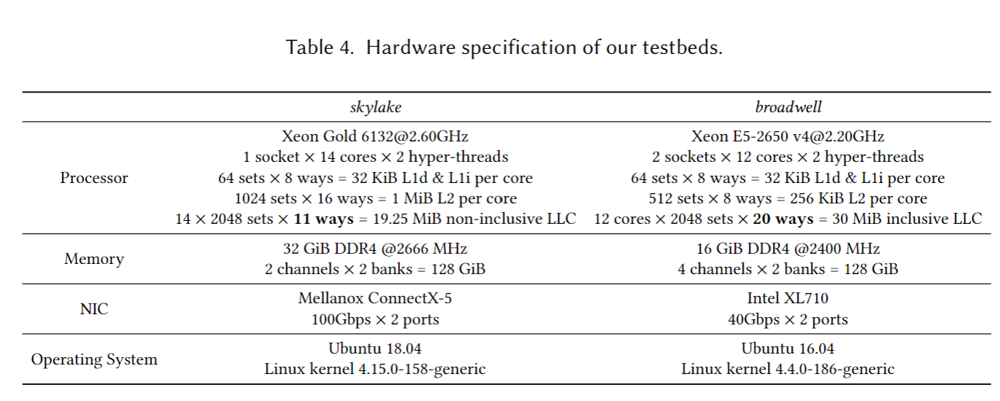

# 两篇论文内容整理

## 术语表
reverse engineer
end-host network
peripheral device
memory wall
leaky DMA problem
latent contender problem
Cache Allocation Technique
Last Level Cache

## Understanding I/O Direct Cache Access Performance for End Host Networking

### 主要内容
- 背景
  - CPU-NIC当前交互模式：`Ring-based CPU-NIC Interaction`
    - MMIO DMA
  - cache结构
    - 多级内存的决策机制 
      - Inclusive:L1 缓存中的所有数据也必须位于 L2 缓存中的某个位置
      - Exclusive:数据保证最多位于 L1 和 L2 缓存之一，绝不会同时位于两者中
      - 其他：不要求 L1 缓存中的数据也驻留在 L2 缓存中，尽管它可能经常这样做
  - DMA:处理高速IO设备时，由DMA存到内存，提高CPU使用率
  - DCA:处理高速IO设备时，由DMA存到CPUcache，提高CPU使用率
    > DCA is a general terminology with varied implementations
    - prefetch hint
    - cache injection
    - dedicated DMA cache
    - DDIO(by Intel)
      > We focus on Intel in this paper because it was, to our best knowledge, the only vendor that provided commercially available processors with DCA support when we started this work. However, other vendors are also actively implementing DCA. For example, ARM has released its version of DCA, Cache Stashing, as part of its DynamIQ technology [5]. Cache Stashing is likely to be supported in upcoming AWS Graviton2 server processors [6].

  
- **揭示DDIO硬件层面细节(T1)**
  - Intel DDIO反向工程
  - buffer anneal 实验:NIC从RXring中取新buffer，故buffer被复用；aneal指buffer在一系列内存读取过程中被移动到cache，wait时又回到memory的过程
  - benchmark:packet-acrobat(receive send forward)
    - 两种CPU微架构skylake boardwell
  - 结论
    -  I/O May Use Much More Cache Than Was Previously Thought
    - 不同的微架构有区别(多级缓存决策机制不同)
- **DCA调优后命中率的分析/预测(T2)**
  > how does the cache hit rate of DCA operations change if we tune X?
  - HPC可用于测量精确运行时间
  - 四种变量
    - (1) hardware specifications, such as cache size and associativity;
    - (2) system configurations, such as RX / TX ring size; 
    - (3) workload characterization, such as packet size;
    -  (4) metrics revealing the runtime behaviors of the workload
  - Markov 过程  
  - 使用microbenchmarks`packet-acrobat`验证

- **系统测量DCA调优后益处(T3)**
  > what is the penalty of a miss by a DCA operation?
  - access latency：miss不一定比hit更长（ns级）
  - DRAM power usage 
  - memory traffic：hit也可能产生memory traffic

- 展望(正确理解DDIO的作用)：设计end-host networking（？？）、软件配置优化、硬件设计

### 应用场景/需求
- software network functions [ 75]
- training deep learning models[ 83], and microservices [62, 66 ] 
  - require end-host networking with hundreds-of-gigabits-scale bandwidth and microseconds-level latency.

- NIC、processor、DRAM发展(memory wall)
- 软件因处理器中cache文档不完备而无法使用DCA
- 根据不同目的，DCA调优
  - ~~减少网络缓冲避免多个网络功能影响(75)( ResQ : Enabling SLOs in Network Function Virtualization)~~
  - 不进行零拷贝以促进缓冲循环(Shenango: Achieving High CPU Efficiency for Latency-sensitive Datacenter Workloads)
  - 保留尽可能多的cache使DCA前递效果更好(PacketMill: toward per-Core 100-Gbps networking)

### 提及硬件
- DDIO
  - [Document](https://www.intel.com/content/dam/www/public/us/en/documents/technology-briefs/data-direct-i-o-technology-brief.pdf)
  - 逆向工程
    - 本文
    - Reexamining Direct Cache Access to Optimize I/O Intensive Applications for Multi-hundred-gigabit Networks. 
    - NetCAT: Practical Cache Attacks from the Network
    - Packet Chasing: Spying on Network Packets over a Cache Side-Channel
    - Attack Directories, Not Caches: Side Channel Attacks in a Non-Inclusive World
    - Don’t Forget the I/O When Allocating Your LLC
- Intel Xeon

- 对应用软件的要求 
  - completing all I/O operations in the cache such that it completely bypasses memory

## Characterization of Direct Cache Access on Multi-core Systems and 10GbE

- DCA在多核/多CPU环境中产生的问题
  - 网络通信处理速率与IO速率不匹配使DCA效果下降
  - 使网络栈和应用上下文关联到共享一块缓存的多核很困难

### 主要内容
- 背景
  - 用网卡平衡IO速度、网络速度、CPU处理速度,仍需解决内存读写对CPU的依赖：DCA

  - IO相关微架构有限：系统层面优化与微架构改进（DCA）关系复杂
    > Due to the complexity of hardware-software interactions, such evaluations are often only possible with realistic implementations with commercial operating systems and network stacks.
- 10GbE与单核
  - 吞吐量与CPU资源使用情况
    - HWP LRO
      - Hardware  Prefetch(HWP)
      -  Large Receive Offload(LRO)
    - DCA 
  - Oprofile测试cache miss rate
  - 传递速率高于3GbE后DCA cache miss 显著升高（CPU占用率过高）
    - 降低中断频率
    - 提高与应用拷贝频率，减少单次传输量
- 四核双CPU平台DCA性能测试
  - NIC将数据流分散到多核
  - DCA+HWP
    - 有无DCA，HWP降低了处理速度
  - DCA+LRO

- 局限性
  - 网络传输速度提高后，DCA效果下降
  - CPU的NUMA架构
- 中断和应用调试协调配合在多核系统上实现DCA效果
- 减少共享内存污染的初步方向

- 一些数据
> The primary result of this paper was that a relatively simple implementation of DCA results in 15 to 43% speed-up on standard operating system network stacks
in a real server system. (“Impact of Cache Coherence Protocols on the processing of Network Traffic”.)

### 提及硬件
- two quad-core Intel® Xeon® processors with Intel® Core™ micro-architecture, (making a total of 8 cores available to Operating System )
- each pair of cores shares a 4MB L2 
- (last level) cache
- For 10Gb/s Ethernet adapter, we have used Intel® 10Gb/s XF server adapter - a PCI Express® (PCIe®) based discrete NIC. 

## Useful Information
- CPU-NIC当前交互模式(原理图)：`Ring-based CPU-NIC Interaction`

- DDIO(by Intel)只能使用Intel的原因
    > We focus on Intel in this paper because it was, to our best knowledge, the only vendor that provided commercially available processors with DCA support when we started this work. However, other vendors are also actively implementing DCA. For example, ARM has released its version of DCA, Cache Stashing, as part of its DynamIQ technology [5]. Cache Stashing is likely to be supported in upcoming AWS Graviton2 server processors [6].

- 项目背景：
  - NIC、processor、DRAM发展(memory wall)
  - 软件因处理器中cache文档不完备而无法使用DCA
  - IO相关微架构有限：系统层面优化与微架构改进（DCA）关系复杂
    > Due to the complexity of hardware-software interactions, such evaluations are often only possible with realistic implementations with commercial operating systems and network stacks.
- 应用场景
  - software network functions [ 75]
  - training deep learning models[ 83], and microservices [62, 66 ]
- 对应用软件的要求 
  - completing all I/O operations in the cache such that it completely bypasses memory

- 硬件支持：Intel Xeon
