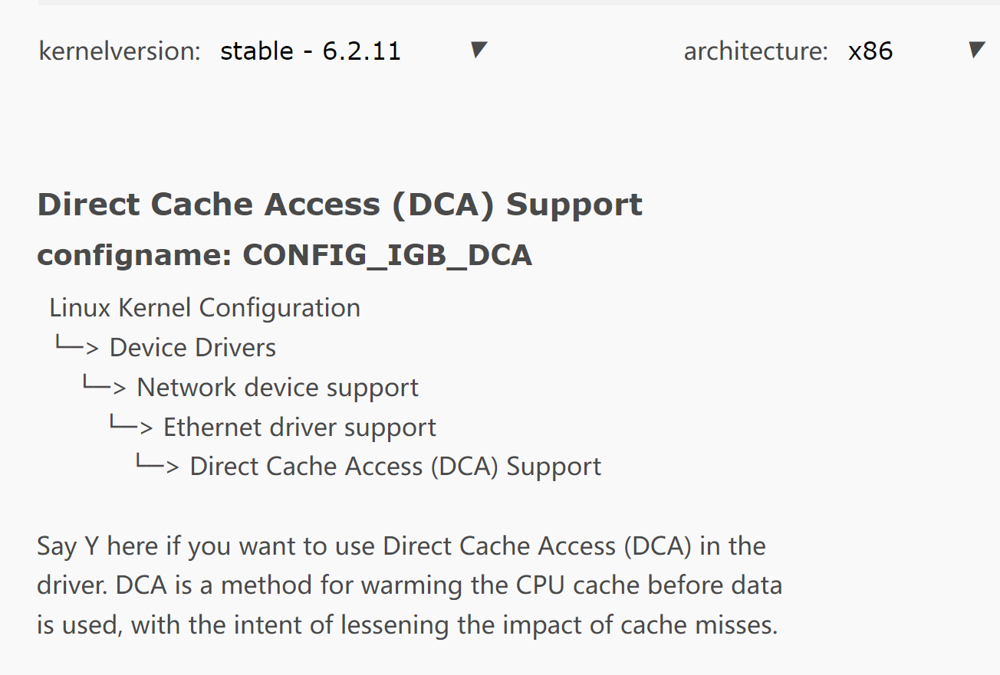

# ROS2基于DCA技术优化实时性的可行性报告

## 小组成员
* 王润泽
* 王道宇
* 封霁芩
* 陈应豪
* 王昱
## 目录
- [项目背景](#项目背景)
## 项目背景：ROS2通信框架的实时性问题

### 实时性和低延迟通信的要求

- **金融领域**
  
  程序化交易系统是接收市场的行情再去进行运算，然后发出交易信号。发出交易信号越早，就越可能挣到钱，如果晚了，钱都被别人挣了，自己可能就会亏钱。所以在这种场景下，**低延迟是第一需求，不会追求吞吐量**。交易所都有流速权，即每秒的报单速度是有限的，不允许做很大的吞吐，所以金融对低延迟的要求是比较高的，也**不在意资源利用率**。因为我们的 `CPU` 会进行绑核，绑核会让 `CPU` 处于 **busy looping**，让它的占有率达到100%，那么资源利用率就没有任何参考价值。
  
  我国金融信息行业，交易所行情数据目前主要采用**STEP**（Securities Trading Exchange
  Protocol）协议，并基于国际主流金融信息交换标准的**FIX**（Financial InformationeX change protocol）协议，根据行情数据的流式处理特征，进行了**FAST**（FIX Adapted For Streaming）编码压缩。

- **在自动驾驶中**
  
  超低延迟通信可以使汽车更快地接收和响应来自传感器的数据，从而提高行驶安全性。近年来由于无人驾驶操作系统处理不及时等问题，已经造成了人员伤亡。想要发展无人驾驶技术，解决相关问题刻不容缓。因此，我们小组希望能对`ROS`操作系统的实时性进行优化，做到快速处理障碍物信息，快速做出刹车处理，保障人身安全。

- **实时视频会议**
  
  超低延迟通信可以确保语音和视频的同步，使会议更加流畅和自然。

### ROS2在Linux系统上实时性的瓶颈

 **`Linux`内核的实时性不足**：
 - `Linux`内核的调度机制并不是针对实时性的，这使得`Linux`无法提供完全实时的响应。
  `ROS2`使用通用的通信框架，它的设计并不是专门为实时性而优化的。`ROS2`使用`DDS`作为通信协议，`DDS`是一种高度灵活的通信协议，但其对实时性能的支持并不足够强大。  

 **`ROS2`的性能瓶颈**
 - **CPU资源占用**：需要占用`CPU`资源进行消息的序列化、反序列化、传输等操作，如果`CPU`资源占用过高，则会影响实时性能

 - **内存管理**：涉及到内存的动态分配和释放，如果内存管理不当，会导致内存碎片问题，从而影响实时性能

> 因此我们需要引入`DCA`技术来大大提高`ROS2`的实时性

## 理论支撑

### `ROS2`通信框架及其应用

- **Publish-Subscribe(1)**
  - ***Pub***通过Topic向***Sub***传递数据
  - 该机制常用于连续数据流，数据可以在任何时间独立于任何***Pub***/***Sub***发布和订阅
- **Service-Client(2)**
  - ***Client***向***Server***发出请求，***Server***执行任务后将response返回给***Client***
  - 该机制常用于快速终止的远程过程调用，不应该用于运行时间较长的进程，特别是，如果发生特殊情况，可能需要抢占的过程。并且它们永远不应改变或依赖于状态，以避免对其他节点产生不必要的副作用
- **Actions(3)**
  - 基于***Service-Client***，在执行任务时产生了多次Fback
  - 该机制常用于移动机器人或**运行更长时间但在执行过程中提供反馈的任何离散行为**


### `NIC`与`CPU`交互模式

网卡(Network Interface Card，简称`NIC`)，也称网络适配器，是电脑与局域网相互连接的设备。

#### Ring-based Model

初始化时，处理器在内存中为传入和传出的数据包分配缓冲区。它在描述符中记录缓冲区的属性(例如，它们的基址和长度)，并将这些描述符存储在两个环中，一个用于发送(`TX`)，另一个用于接收(`RX`)。


- **数据包到达时**
  - S2:NIC读取环头指向的描述符以获取空缓冲区，将数据包内容写入缓冲区，并更新描述符以记录数据包的属性。
  - S3:向处理器发送中断，以通知数据包的到达。
  - S4:处理器通过中断或对尾指针所指向的描述符进行忙轮询来得到通知。它给出一个新的描述符，指向`RX`环的空缓冲区，移动尾指针，并将接收到的缓冲区移交给应用程序。
- **发送数据包时**
  - S5: 一旦处理程序完成，驱动程序在`head`指针指向的空`TX`描述符上申请缓冲区，并移动指针提示`NIC`;
  - S6: `NIC`读取`TX`描述符，获取缓冲区，并将其内容发送到线路，移动`TX`尾以指示数据包发送完成;
  - S7: 驱动定期检查TX环以回收已发送的缓冲区

NIC与处理器有多种交换数据信息的模式，包括中断、内存映射IO (MMIO)和直接内存访问(DMA)。

### 网卡驱动

使用网卡需在操作系统上运行驱动程序。
Linux内核操作系统中，Intel网卡驱动有三种：

- **igb-x.x.x.tar.gz driver**
- **e1000e-x.x.x.x.tar.gz driver**
- **e1000-x.x.x.tar.gz driver**

可以从[官网](https://www.intel.com/content/www/us/en/support/articles/000005480/ethernet-products.html?wapkw=igb%20dca)下载自行安装。部分Intel网卡驱动（e1000e和e1000）为操作系统内部驱动，也可以在内核配置编译时开启，如下图：


对于支持`DCA`的网卡：若内核支持`DCA`服务，则`igb driver`默认`DCA`开启。

### DMA与DCA技术介绍

 `DMA` (Direct Memory Access)技术，其基本思想是外设和 `RAM` 之间开辟直接的数据传输通路。一般情况下，总线所有的工作周期（总线周期）都用于`CPU` 执行程序。`DMA` 控制就是当外设完成数据 `I/O` 的准备工作之后，会占用总线的一个工作周期，和 `RAM` 直接交换数据。这个周期之后，`CPU`又继续控制总线执行原程序。如此反复的，直到整个数据块的数据全部传输完毕，从而解放了`CPU`。

 `DCA` (Direct Cache Access)技术通过将目标从内存更改为处理器缓存来改进`DMA`。这有助于减少`I/O`延迟，并通过防止数据在内存总线上传输两次来节省内存带宽。`DCA`是一个通用术语，其实现方式各异。

#### DMA

- **总线控制**：`CPU`和外设再写入系统内存时，可能发生总线争用，有以下三种方式处理冲突：
  
  - **突发模式（Burst mode）**：在突发模式下，整个数据块以一个连续的序列传输。一旦 `DMA` 控制器被 `CPU` 授予对系统总线的访问权限，它就会在将系统总线的控制权交还给` CPU `之前传输数据块中的所有字节数据，但会使`CPU `在相对较长的时间内处于非活动状态。
  - **循环窃取模式（Cycle stealing mode）**：循环窃取模式用于` CPU `不应在突发传输模式所需的时间长度内被禁用的系统。在循环窃取模式下，通过不断获得和释放对系统总线的控制，`DMA` 控制器实质上交织了指令和数据传输。`CPU` 处理一条指令，然后 `DMA` 控制器传输一个数据值，依此类推。数据传输速度没有那么快，但 `CPU` 的空闲时间没有突发模式那么长。
  - **透明模式（Transparent mode）**：透明模式需要最多的时间来传输数据块，但就整体系统性能而言，它也是最有效的模式。在透明模式下，`DMA` 控制器仅在` CPU` 执行不使用系统总线的操作时传输数据。透明模式的主要优点是 `CPU` 永远不会停止执行其程序并且 `DMA` 传输在时间上是免费的，而缺点是硬件需要确定 `CPU` 何时不使用系统总线，这可能很复杂.
* **缓存一致性（Cache coherency）**


> 当设备向内存写入数据时，由于`CPU`可能会将数据缓存在`L1、L2、L3`缓存中，设备无法直接访问缓存，因此会向内存中写入数据，但是缓存中的数据可能已经发生了改变。同样地，当设备从内存中读取数据时，由于`CPU`可能将数据缓存在缓存中，设备读取的数据可能是缓存中的数据，而不是最新的数据。这就是所谓的缓存一致性问题。 为了解决缓存一致性问题，现代的`CPU`和设备通常采用了一些技术来保证缓存一致性。例如，`CPU`可以使用`cache`一致性协议（如`MESI`）来保证多个缓存之间的一致性。当设备向内存写入数据时，缓存中对应的数据会被标记为“失效”，即无效状态，这样在其他缓存中的数据就会被清除。当`CPU`访问该内存地址时，会从内存中重新读取最新的数据，从而保证缓存一致性。 `DMA`控制器通常也采用类似的机制来保证缓存一致性。在进行`DMA`数据传输时，`DMA`控制器会通知`CPU`缓存该内存地址中的数据已经失效，以便`CPU`在下次访问该内存地址时能够从内存中读取最新的数据，而不是从缓存中读取旧数据。一些现代的`DMA`控制器甚至支持`cache`一致性协议，从而可以直接与`CPU`的缓存进行通信，提高了系统的性能和可靠性。

>  [MESI协议](https://zhuanlan.zhihu.com/p/123926004) 所有`cache`与内存，`cache`与`cache`（`cache`之间也会有数据传输）之间的传输都发生在一条共享的总线上，而所有的`CPU`都能看到这条总线，同一个指令周期中，只有一个`cache`可以读写内存，所有的内存访问都要经过仲裁（arbitrate）。

>  `MESI`协议的思想是，`cache`不但与内存通信时和总线打交道，而且它会不停地窥探总线上发生的数据交换，跟踪其他`cache`在做什么。所以当一个`cache`代表它所属的`CPU`去读写内存时，其它`CPU`都会得到通知，它们以此来使自己的`cache`保持同步。

- **DMA传输模式**
  
  - 外设到存储器
  - 存储器到外设
  - 存储器到存储器

- **`DMA`和`DCA`有什么不同，为什么要使用`DCA`**
  
  `DMA`是一种技术，允许设备（如网卡、磁盘控制器）直接访问主存储器，而不需要CPU的干预。这意味着，当设备需要读写大量数据时，它们可以通过DMA技术来减轻CPU的负担，从而提高系统的性能。
  
  `DCA`则是一种通过`DMA`技术来让外设直接访问处理器缓存的技术。它允许外设将数据直接放入或从缓存中取出数据，而不需要`CPU`干预。这可以提高系统的性能，因为数据不需要从主存中读取或写入，而是可以直接在缓存中处理。
  
  使用`DCA`有多种好处，包括：
  
  - 降低了`CPU`的负担，因为外设可以直接与缓存通信，而不需要`CPU`来中介。
  
  - 提高了数据访问的效率，因为数据可以直接从缓存中读取或写入，而不需要访问主存。
  
  - 减少了内存带宽的压力，因为数据可以在缓存中处理，而不需要从主存中读取或写入。
  
  总之，`DCA`是一种通过`DMA`技术来提高系统性能的技术，它可以使外设直接访问处理器缓存，从而降低CPU的负担并提高数据访问的效率。

#### DCA的优势

* **`DCA`的优势**
  
  * `DCA`显著减少接收密集型网络`I/O`的**内存延迟和内存带宽**
  * `DCA`可以减少很大一部分的`cache misses`
  * `DCA`技术通过将远程内存数据直接预取到处理器的缓存中，避免了传统访问模式下频繁的内存访问，从而减少了CPU与内存之间的数据传输和访问延迟，提高了**系统的吞吐量和响应速度**。与传统`DMA（Direct Memory Access，直接内存访问）`技术相比，`DCA`技术可以实现更高的效率和性能，同时还能降低系统的负载和功耗

* 通过直接访问`CPU`缓存中的数据，减少`CPU`与内存之间的数据传输时间，从而减少了`CPU`资源的占用。

## 操作系统内核配置

> 经过查询，我们发现了`Linux kernel    6.2.11 stable version`支持`DCA`的选项



## 如何调用DCA

- **检查CPU是否支持DCA功能**
  `DCA`功能只适用于支持`DCA`的`Intel CPU`，可以使用以下命令来检查`CPU`是否支持`DCA`功能：
  
  ```bash
  cat /proc/cpuinfo | grep dca
  ```
  
  如果支持，则会显示以下内容：
  
  ```bash
  dca: Direct Cache Access (DCA) 
  ```

- **启用DCA功能**
  `DCA`功能默认情况下是禁用的，需要在`BIOS`中启用`DCA`功能。

- **安装并启用DCA驱动程序**
  您需要安装支持`DCA`功能的驱动程序，并在系统启动时启用该驱动程序。在`Linux`系统中，可以使用以下命令来检查是否已安装`DCA`驱动程序：
  
  ```bash
  lsmod | grep dca
  ```
  
  如果未安装`DCA`驱动程序，则需要先安装`DCA`驱动程序。

## 相关代码与实现

### 调用DCA的基本步骤及相关的头文件

>  [dca.h头文件](https://github.com/torvalds/linux/blob/master/include/linux/dca.h)
> 
>  下面是一些重要的函数、结构体

```cpp
//注册一个DCA提供者的函数
int register_dca_provider(struct dca_provider *dca, struct device *dev);
//注销一个DCA提供者的函数
void unregister_dca_provider(struct dca_provider *dca, struct device *dev);
//结构体
struct dca_provider {
    struct list_head    node;
    const struct dca_ops    *ops;
    struct device         *cd;
    int             id;
};

struct dca_domain {
    struct list_head    node;
    struct list_head    dca_providers;
    struct pci_bus        *pci_rc;
};

struct dca_ops {
    int    (*add_requester)    (struct dca_provider *, struct device *);
    int    (*remove_requester) (struct dca_provider *, struct device *);
    u8    (*get_tag)        (struct dca_provider *, struct device *,
                     int cpu);
    int    (*dev_managed)      (struct dca_provider *, struct device *);
};
//添加一个DCA请求的函数
int dca_add_requester(struct device *dev);
//删除一个DCA请求的函数
int dca_remove_requester(struct device *dev);
```

* **引入头文件**：通常需要引入相关的系统或库文件的头文件，以便在代码中调用相应的函数或接口。例如，在`Linux`系统中，可以引入**<linux/dca.h>头文件**来使用`DCA`相关的函数和宏定义。

* **初始化DCA**：需要在程序启动时进行`DCA`的初始化，以确保`DCA`功能可以正常使用。通常需要调用相关的函数或接口，例如在`Linux`系统中，可以使用**dca_sysfs_init()函数**来初始化`DCA`。

* **配置DCA**：需要根据具体的应用场景和数据访问模式来配置`DCA`，例如设置预取的数据大小和预取的地址等参数。通常需要使用相应的函数或接口来进行配置，例如在`Linux`系统中，可以使用**dca3_config()函数**来配置`DCA`。

* **调用DCA**：在程序运行时，可以使用相应的函数或接口来调用`DCA`功能，以实现预取数据到缓存中。例如在`Linux`系统中，可以使用**dca3_get_tag()函数**来执行`DCA`操作。

### 网卡驱动的相关头文件

[linux/driver/net/ethernet/Intel](https://github.com/torvalds/linux/tree/master/drivers/net/ethernet/intel)

## 硬件支持

### 使用Intel的原因

据调研，目前`Intel`是唯一提供带有`DCA`支持的商用处理器的供应商
(补充：其他供应商)

### IOAT-DDIO

- ``IOAT``技术简介
  
  ``IOAT``（I/O Acceleration Technology）是英特尔开发的一种数据传输加速技术，主要用于优化服务器等高性能计算机系统中的数据传输速度。``IOAT``技术利用``DMA``技术，通过硬件直接传输数据，避免了`CPU`介入，可以大幅提高数据传输速度。
  
  如今，多端口千兆以太网（GbE）和10千兆以太网（10GbE）网络适配器提供了巨大的数据流，需要先进的服务器`I/O`子系统以避免性能瓶颈。英特尔® `IOAT`技术可以改善平台上的数据流，提高系统性能。
  
  `IOAT`技术是Intel的一系列先进`I/O`加速技术的集合，是`Intel`在`I/O`加速领域的具体实践。下面为`IOAT`技术的具体细分方向：
  
  - **Direct Cache Acces (DCA)** 允许有能力的 I/O 设备（例如网络控制器）将数据直接放入 CPU 缓存中，从而减少缓存未命中并缩短应用程序响应时间。
  - **Intel® QuickData Technology **支持通过芯片组而不是 CPU 进行数据复制，从而更有效地通过服务器移动数据并提供快速、可扩展和可靠的吞吐量。
  - **Extended Message Signaled Interrupts (MSI-X)** 将 I/O 中断分配给多个 CPU 和内核，以获得更高的效率、更好的 CPU 利用率和更高的应用程序性能。
  - **Receive Side Coalescing (RSC)** 将来自同一 TCP/IP 流的数据包聚合成一个更大的数据包，从而降低每个数据包的处理成本，从而实现更快的 TCP/IP 处理。
  - **Low latency interrupts**根据数据的延迟敏感性调整中断间隔时间，使用端口号或数据包大小等标准，以获得更高的处理效率。
  
  可见，`DCA`技术在Intel I/O加速领域起到举足轻重的地位。前者是后者的子集。

- `DDIO`技术概览
  
  > Intel® Data Direct I/O Technology（Intel® DDIO）是Intel® Xeon®处理器**E5系列和Intel® Xeon®处理器E7 v2系列**中引入的功能，是Intel® Integrated I/O的关键特性之一。 
  > 
  > Intel DDIO是智能系统级I/O性能改进的最新Intel创新。Intel创建了Intel DDIO，使Intel®以太网控制器和适配器能够**直接与Intel Xeon处理器缓存通信**。 
  > 
  > Intel DDIO**使处理器缓存成为I/O数据的主要目的地和源**，而不是主存储器，有助于提供更高的带宽，更低的延迟和更少的功耗。
  
  `DCA`技术是一个通用术语，其实现方式各异。阅读`Intel`官方文档可知，`DDIO`技术是`Intel`对于`DCA`技术的具体技术实现方式。尽管对于`DCA`技术的学术研究早在2005年就已经开始，目前仅仅只有`Intel`公司提供完整、可行的`DCA`商业解决方案——`DDIO`技术。

- `DDIO`技术硬件支持
  
  > `Intel DDIO` 在所有`Intel Xeon` 处理器 `E5` 系列和 `Intel Xeon` 处理器 `E7 v2` 系列平台上默认启用。 英特尔 `DDIO` 不依赖硬件，对软件不可见，无需更改驱动程序、操作系统、管理程序或应用程序。 所有 `I/O` 设备都受益于英特尔 `DDIO`，包括以太网、`InfiniBand*`、光纤通道和 `RAID`。
  
  可见，`Intel`对于`DDIO`技术进行了高度封装，使得用户不需要过分关注硬件的底层实现，可以专注于操作系统和软件层面的配置与开发，大大提高了用户使用该技术的效率。
  
  结合指导老师和我们小组内部讨论的观点，在我们的项目中，我们将专注于软件方面的实现，将尽可能减少在硬件层面对于`DDIO`技术具体实现的研究。

## 实验与评估方法

### 实验步骤

> 1. 挑选适合的`linux`版本，要求支持`DCA`。编译内核，勾选相应的`DCA`支持模块。
> 2. 安装`ROS`库，用`C/C++`调用相关库函数实现节点间通信
> 3. 使用智能网卡，实现数据通信的`DMA`
> 4. 引用`linux/dca.h`等库函数，实现对本地/传输数据`0`拷贝进入`cache`，实现`DCA`
> 5. 找一个`I/O`密集型，单次处理数据量小的任务，通过系统给出的函数进行计时，测试使用了相关技术前后的时间差异

- 验证方法
  
  - 对比程序自己编写
  
  - 数据传输：使用`ROS`相关的库函数，使用`linux DCA`库，放进`cache`计算，`IO`密集型。
  
  - 正常的数据传输，用`clk`粗略计时，比较其他的方案
    
## 结论
经过一个月的调研与讨论，我们通过网络搜索、阅读文章等途径认识到`ROS`操作系统对实时性的需求，学习了`DCA`原理和大量相关知识。我们找到了支持`DCA`功能的处理器、网卡、操作系统内核；找到了编写代码调用的头文件函数等，找到了性能评估的实验方法，具备了完成本次实验的条件。

## 参考文献

- [Understanding I/O Direct Cache Access Performance for End Host Networking](../reference/Understanding%20IO%20Direct%20Cache%20Access%20Performance%20for%20End%20Host%20Networking.pdf)

- [A case for effective utilization of Direct Cache Access for big data workloads](../reference/A%20case%20for%20effective%20utilization%20of%20Direct%20Cache%20Access%20for%20big%20data%20workloads.pdf)

- [Direct Cache Access for High Bandwidth Network I/O](../reference/Direct_cache_access_for_high_bandwidth_network_I_O.pdf)

- [Accelerating High-Speed Networking with Intel® I/O Acceleration Technology]()
