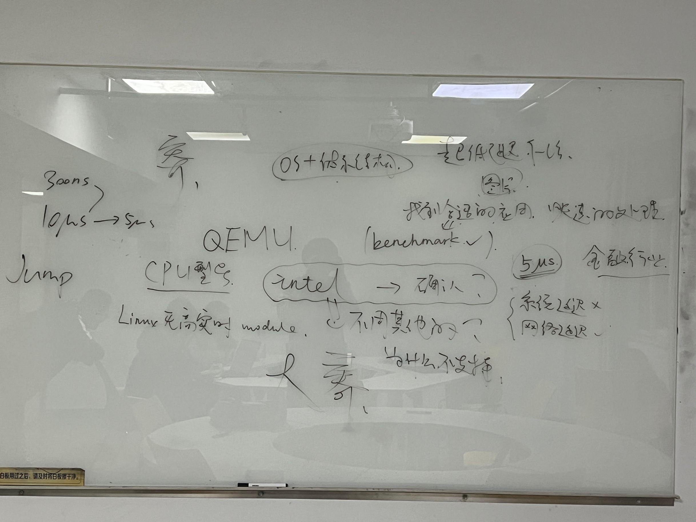

# 第五次会议（老师参与）

**时间：** 2023/04/07 19:00--21：50
**地点：** 西图209研讨室

## 和老师交流记录：天下武功唯快不破
需要实现：ROS高实时模块：CPU和网卡直接通信

关键词：超低延迟

要求：
    针对操作系统 
    针对Cache 存储计算的模块
    避开ROS2的其他优化方向
    避免内存拷贝

验证方式：ROS的相关 **需要高实时模块的软件应用** （不要小车）

调研：
    针对CPU（x86 Intel）和网卡之间的指令确认
    实现平台待验证：暂定QEMU虚拟机

金融领域已实现5微秒   

**思路：**
- 流程跑通+找到应用（图片传输）
- 通过操作系统 + 体系结构 以提高ROS性能

## 调研报告修改

- 项目背景：暂不修改
- 立项依据
  - 新增关键词：超低延迟
  - cache存储计算
- 重要性分析
    - 金融领域
    - 无人驾驶保留
- 删掉硬件支持，加QEMU资料
- ROS2的相关 **需要高实时模块的软件应用**作为验证
- 针对CPU（x86 Intel）和网卡之间直接通信的指令
  
> Intel体系结构为什么可行？（可行性报告

## 分工
- 所有人均调研：
  - 针对CPU（x86 Intel）和网卡之间直接通信的指令
  - ROS2的相关 **需要高实时模块的软件应用**作为验证

* 王润泽 cache存储计算
* 王道宇 金融领域，QEMU 
* 封霁芩 cache存储计算
* 陈应豪 超低延迟                                                        
* 王昱  QEMU，