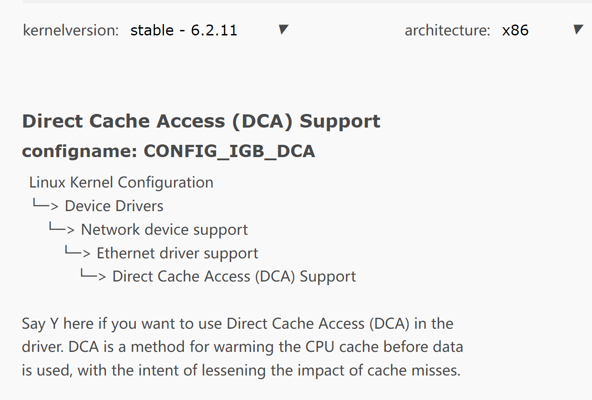

# 可能用到的工具/信息整合（不包含理论知识）

## 硬件使用
### CPU
- **老师的服务器**
  虚拟机
- **个人计算机**

  ROS可以在Linux、Windows和macOS等操作系统上运行。如去年[x-NooBirds](https://github.com/OSH-2022/x-NooBirds)采用改造后的实时linux操作系统，运行小车服务器。

  todo:CPU要求？？

### 网卡型号
todo

## Linux

### DAC调用
- `Linux kernel    6.2.11 stable version`支持`DCA`的选项
    
- **检查CPU是否支持DCA功能**
  `DCA`功能只适用于支持`DCA`的`Intel CPU`，可以使用以下命令来检查`CPU`是否支持`DCA`功能：
  
  ```bash
  cat /proc/cpuinfo | grep dca
  ```
  
  如果支持，则会显示以下内容：
  
  ```bash
  dca: Direct Cache Access (DCA) 
  ```

- **启用DCA功能**
  `DCA`功能默认情况下是禁用的，需要在`BIOS`中启用`DCA`功能。

- **安装并启用DCA驱动程序**
  您需要安装支持`DCA`功能的驱动程序，并在系统启动时启用该驱动程序。在`Linux`系统中，可以使用以下命令来检查是否已安装`DCA`驱动程序：
  
  ```bash
  lsmod | grep dca
  ```
  
  如果未安装`DCA`驱动程序，则需要先安装`DCA`驱动程序。


- C语言中[dca.h头文件](https://github.com/torvalds/linux/blob/master/include/linux/dca.h)

    下面是一些重要的函数、结构体

    ```C++
    //注册一个DCA提供者的函数
    int register_dca_provider(struct dca_provider *dca, struct device *dev);
    //注销一个DCA提供者的函数
    void unregister_dca_provider(struct dca_provider *dca, struct device *dev);
    //结构体
    struct dca_provider {
        struct list_head	node;
        const struct dca_ops	*ops;
        struct device 		*cd;
        int			 id;
    };

    struct dca_domain {
        struct list_head	node;
        struct list_head	dca_providers;
        struct pci_bus		*pci_rc;
    };

    struct dca_ops {
        int	(*add_requester)    (struct dca_provider *, struct device *);
        int	(*remove_requester) (struct dca_provider *, struct device *);
        u8	(*get_tag)	    (struct dca_provider *, struct device *,
                        int cpu);
        int	(*dev_managed)      (struct dca_provider *, struct device *);
    };
    //添加一个DCA请求的函数
    int dca_add_requester(struct device *dev);
    //删除一个DCA请求的函数
    int dca_remove_requester(struct device *dev);
    ```

    * **引入头文件**：通常需要引入相关的系统或库文件的头文件，以便在代码中调用相应的函数或接口。例如，在Linux系统中，可以引入**<linux/dca.h>头文件**来使用DCA相关的函数和宏定义。

    * **初始化DCA**：需要在程序启动时进行DCA的初始化，以确保DCA功能可以正常使用。通常需要调用相关的函数或接口，例如在Linux系统中，可以使用**dca_sysfs_init()函数**来初始化DCA。

    * **配置DCA**：需要根据具体的应用场景和数据访问模式来配置DCA，例如设置预取的数据大小和预取的地址等参数。通常需要使用相应的函数或接口来进行配置，例如在Linux系统中，可以使用**dca3_config()函数**来配置DCA。

    * **调用DCA**：在程序运行时，可以使用相应的函数或接口来调用DCA功能，以实现预取数据到缓存中。例如在Linux系统中，可以使用**dca3_get_tag()函数**来执行DCA操作。
  
### DMA API
[linux DMA API 使用指导](https://zhuanlan.zhihu.com/p/496060255)

## 网卡驱动

使用网卡需在操作系统上运行驱动程序。
Linux内核操作系统中，Intel网卡驱动有三种：

- **igb-x.x.x.tar.gz driver**
- **e1000e-x.x.x.x.tar.gz driver**
- **e1000-x.x.x.tar.gz driver**

可以从[官网](https://www.intel.com/content/www/us/en/support/articles/000005480/ethernet-products.html?wapkw=igb%20dca)下载自行安装。部分Intel网卡驱动（e1000e和e1000）为操作系统内部驱动，也可以在内核配置编译时开启，如下图：


对于支持`DCA`的网卡：若内核支持`DCA`服务，则`igb driver`默认`DCA`开启。

- [网卡调用头文件linux/driver/net/ethernet/Intel](https://github.com/torvalds/linux/tree/master/drivers/net/ethernet/intel)

## ROS

### ROS版本

- ROS1
  - ~~MELODIC MORENIA~~
    - 支持到2023/05
    - 推荐OS:Ubuntu 18.04
  - NOETIC NINJEMYS(Recommended)
    - 支持到2025/05
    - Ubuntu Linux - Focal (20.04)
    - Debian Linux - Buster (10)
- ROS2
  - ~~FOXY FITZROY~~
  - HUMBLE HAWKSBILL(Recommended)
    - [安装教程](https://docs.ros.org/en/humble/Installation.html)
    - Ubuntu Linux - Jammy (22.04) 64-bit
    - Ubuntu Linux - Focal (20.04) 64-bit
    - Debian Linux - Bullseye (11) 64-bit
    - Win10 VS2019
    - RHEL 8 64-bit
    - macOS Mojave (10.14)
  - ROLLING RIDLEY(In Development)
    - Ubuntu Linux - Jammy (22.04) 64-bit
    - Win10 VS2019
    - RHEL 8 64-bit

### 相关链接

- [ROS——常用工具_ubuntu qt rviz_cchangcs的博客-CSDN博客](https://blog.csdn.net/github_39611196/article/details/82956368)

- [ROS不同版本官方文档](http://docs.ros.org/)
- [ROS2中文版文档](http://dev.ros2.fishros.com/doc/index.html)